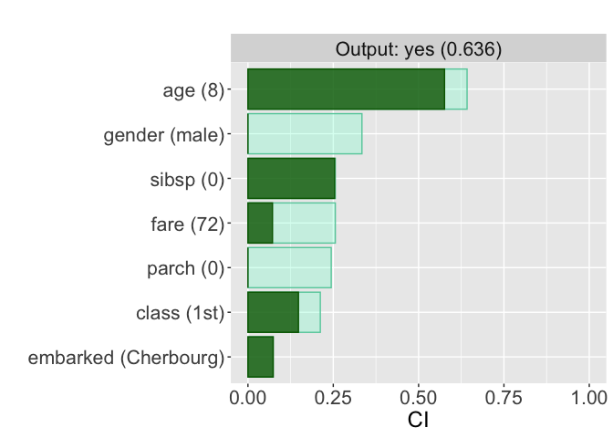
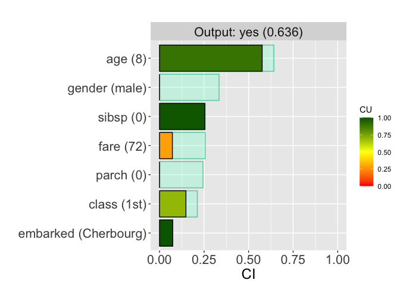
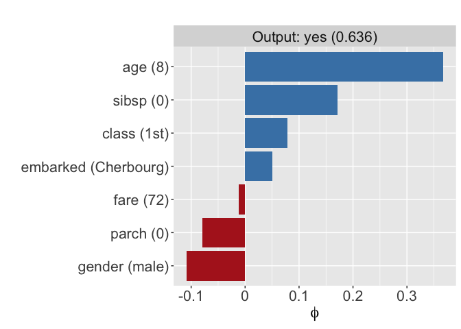
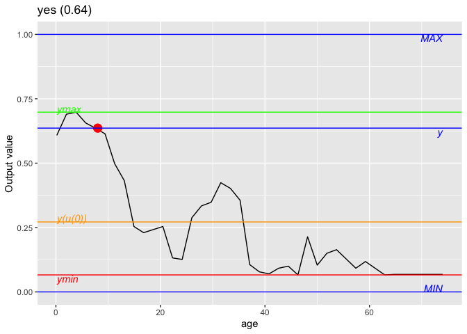
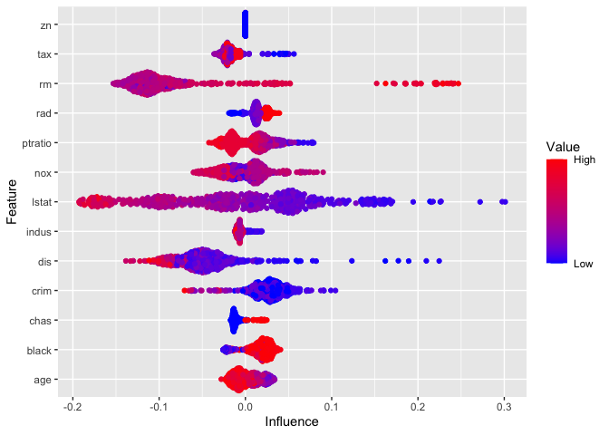
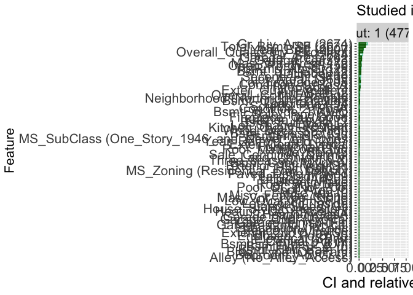
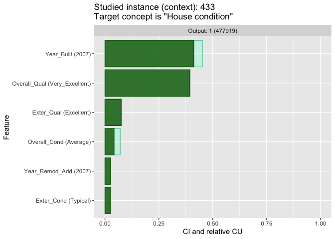
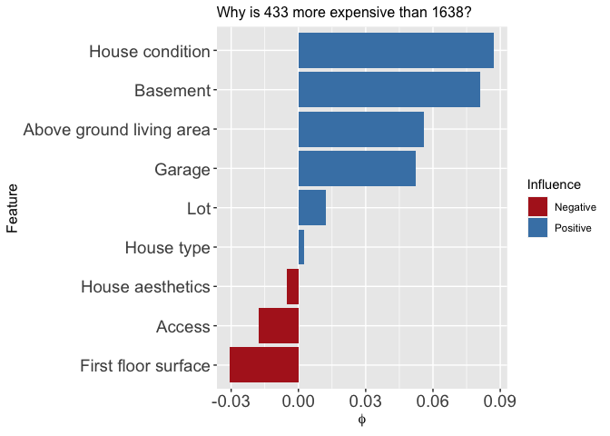

***Author**: Kary Främling, 23 May 2023.*

You might be reading the README.md file generated by “knitr” from the
EXTRAAMAS_2023.Rmd [R Markdown](http://rmarkdown.rstudio.com) Notebook.
If you open the Rmd file in RStudio, you can execute code chunks by
clicking the *Run* button within the chunk or by placing your cursor
inside it and pressing *Cmd+Shift+Enter*.

## Counterfactual, Contrastive and Hierarchical Explanations with Contextual Importance and Utility

This R notebook produces the results shown in the paper “Counterfactual,
Contrastive and Hierarchical Explanations with Contextual Importance and
Utility” by Kary Främling, (to be) published in the proceedings of the
5<sup>th</sup> International Workshop on EXplainable and TRAnsparent AI
and Multi-Agent Systems (EXTRAAMAS 2023).

### Basic definitions

***Contextual Importance (CI)*** expresses to what extent modifying the
value of one or more feature(s) *x<sub>{i}</sub>* can affect the output
value *y<sub>j</sub>* (or rather the output utility
*u<sub>j</sub>(y<sub>j</sub>)*).

***Contextual Utility (CU)*** expresses to what extent the current
value(s) of given feature(s) contribute to obtaining a high output
utility *u<sub>j</sub>*.

***Contextual influence*** expresses how much feature(s) influence the
output value (utility) relative to a *reference value* or *baseline*.

*According to these definitions, methods such as Shapley value and LIME
produce influence values (not importance values).*

### Demonstration

The code here works with the CIU implementation at
<https://github.com/KaryFramling/ciu>, since the code push on 23 May
2023. Installation instructions are found there. An official package
release to CRAN with the newest functionality will be made later.

Once the CIU package has been installed, some preliminary setup:

``` r
library(ciu)
library(caret)
library(reshape2)
library(data.table)

# Common text sizes everywhere by own theme.
own_theme = theme(
  plot.title = element_text(size = 18),
  axis.title.x = element_text(size = 18),
  axis.text = element_text(size = 16),
  axis.title.y = element_text(size = 16),
  strip.text = element_text(size=16)
)

# Function for having only two decimals max in plots.
scaleFUN <- function(x) as.character(round(x, digits = 2))
```

### Counterfactual explanations and visualisation

We begin with some “counterfactual” explanations using CIU. The used
dataset is Titanic. We train a Random Forest model (with message output
suppressed here).

``` r
# We use the existing data set from the DALEX package and do some small pre-processing on it. 
library("DALEX")
titanic_data <- titanic[,c("class", "gender", "age", "sibsp", "parch", "fare", "embarked", "survived")]
titanic_data$survived <- factor(titanic_data$survived)
titanic_data$gender <- factor(titanic_data$gender)
titanic_data$embarked <- factor(titanic_data$embarked)
titanic_data <- na.omit(titanic_data)

# Train Random Forest model. 
set.seed(42) # We want to be sure to always get same model
inTrain <- createDataPartition(y=titanic_data$survived, p=0.75, list=FALSE) # 75% to train set
titanic.train <- titanic_data[inTrain,]
titanic.validate <- titanic_data[-inTrain,]
kfoldcv <- trainControl(method="cv", number=10)
if ( !exists("titanic_rf") ) {
  titanic_rf <- caret::train(survived ~ ., titanic.train, method="rf", trControl=kfoldcv)
}
predictions <- predict(titanic_rf, newdata=titanic.validate)
```

Show confusion Matrix and performance metrics

``` r
caret::confusionMatrix(predictions, titanic.validate$survived) 
```

    ## Confusion Matrix and Statistics
    ## 
    ##           Reference
    ## Prediction  no yes
    ##        no  340  76
    ##        yes  27 101
    ##                                           
    ##                Accuracy : 0.8107          
    ##                  95% CI : (0.7752, 0.8427)
    ##     No Information Rate : 0.6746          
    ##     P-Value [Acc > NIR] : 9.149e-13       
    ##                                           
    ##                   Kappa : 0.5354          
    ##                                           
    ##  Mcnemar's Test P-Value : 2.250e-06       
    ##                                           
    ##             Sensitivity : 0.9264          
    ##             Specificity : 0.5706          
    ##          Pos Pred Value : 0.8173          
    ##          Neg Pred Value : 0.7891          
    ##              Prevalence : 0.6746          
    ##          Detection Rate : 0.6250          
    ##    Detection Prevalence : 0.7647          
    ##       Balanced Accuracy : 0.7485          
    ##                                           
    ##        'Positive' Class : no              
    ## 

We use the instance “Johnny D” from <https://ema.drwhy.ai>

``` r
new_passenger <- data.frame(
  class = factor("1st", levels = c("1st", "2nd", "3rd", "deck crew", "engineering crew", "restaurant staff", "victualling crew")),
  gender = factor("male", levels = c("female", "male")),
  age = 8,
  sibsp = 0,
  parch = 0,
  fare = 72,
  embarked = factor("Cherbourg", levels = c("Belfast", "Cherbourg", "Queenstown", "Southampton")),
  survived = factor("yes", levels = c("no", "yes"))
)
```

Then get CIU barplot explanation, first with CU value illustrated with
colour. CI value is shown by the bar length:

``` r
out.name <- "yes"
survival_probability <- predict(titanic_rf, new_passenger, type="prob")$yes
titanic_ciu <- ciu.new(titanic_rf, survived~., titanic.train)
titanic_ciu.meta <- titanic_ciu$meta.explain(new_passenger[,-ncol(titanic.train)])
p <- titanic_ciu$ggplot.col.ciu(new_passenger[,-ncol(titanic.train)], output.names = out.name, ciu.meta=titanic_ciu.meta) +
  labs(title="", x ="", y="CI", fill="CU") + own_theme
print(p)
```

<!-- -->

We see that “age” is the most important feature and the value “8” is
good for the probability of survival, illustrated by the green color.
“Gender” is the second-most important feature and being “male” reduces
the probability of survival.

A more recent CIU visualization is more precise and “counterfactual”
(answering a “what-if” question):

``` r
p <- titanic_ciu$ggplot.col.ciu(new_passenger[,-ncol(titanic.train)], output.names = out.name, ciu.meta=titanic_ciu.meta, plot.mode = "overlap") +
  labs(title="", x ="", y="CI", fill="CU") + own_theme
print(p)
```

<!-- -->

This visualization is more precise than the colour-coded one. The length
of the transparent bar corresponds to the CI value. The solid bar
corresponds to the CU value, so that when CU=1 the solid bar cover the
transparent bar entirely, thereby showing that the current value of the
instance for that feature is the best possible one.

Here, we can see that the number of accompanying siblings (feature
“sibsp”) and parents (feature “parch”) are both quite important. For the
case of “Johnny D”, not having any siblings is favorable for the
probability of survival, whereas traveling without parents (“parch=0”)
reduces the probability of survival. This kind of insight would be
useful for situations when there is a possibility to actually change the
values somehow in order to increase the output probability, as in the
case of being accepted to a school, getting an employment or getting a
bank loan.

This plot can also be combined with colors for CU:

``` r
p <- titanic_ciu$ggplot.col.ciu(new_passenger[,-ncol(titanic.train)], output.names = out.name, ciu.meta=titanic_ciu.meta, plot.mode = "overlap", cu.colours=NULL) +
  labs(title="", x ="", y="CI", fill="CU") + own_theme
print(p)
```

<!-- -->

How to best visualize explanations is a science of its own. CIU can also
give the same CIU explanation as text, as here (bold/italic etc effects
require using the “crayon” package):

``` r
cat(titanic_ciu$textual(new_passenger[,-ncol(titanic.train)], ciu.meta=titanic_ciu.meta, use.text.effects = TRUE))
```

    ## The value of output 'no' for instance '1' is 0.364, which is bad (CU=0.364).
    ## Feature 'age' is very important (CI=0.642) and value '8' is very bad (CU=0.103).
    ## Feature 'gender' is slightly important (CI=0.334) and value 'male' is very good (CU=1).
    ## Feature 'sibsp' is slightly important (CI=0.256) and value '0' is very bad (CU=0.008).
    ## Feature 'fare' is slightly important (CI=0.256) and value '72' is good (CU=0.719).
    ## Feature 'parch' is slightly important (CI=0.244) and value '0' is very good (CU=1).
    ## Feature 'class' is slightly important (CI=0.212) and value '1st' is bad (CU=0.302).
    ## Feature 'embarked' is not important (CI=0.074) and value 'Cherbourg' is very bad (CU=0).

The counterfactual explanations shown above are possible due to CIU’s
separation of (Contextual) **Importance** and **Utility**. It is also
possible to produce Contextual **influence** explanations, which is what
Shapley values, LIME and similar methods produce. Influence values are
always relative to a reference value or baseline, which is here called
“neutral.CU”. “neutral.CU” can be anything in the interval \[0,1\] and
the choice depends on what CU value considered a reference value for the
application at hand (which is not possible e.g. with Shapley value). In
order to simplify comparison with Shapley value, we here set
“neutral.CU” to the utility value of the average output probability of
survival (sorry for complicated phrase) and create the corresponding bar
plot, using the usual colors used in LIME implementations:

``` r
# Get average probability of survival, use as normal.CU
neutral.CU <- sum(titanic_data$survived==out.name)/nrow(titanic_data)
p2 <- titanic_ciu$ggplot.col.ciu(new_passenger[,-ncol(titanic.train)], output.names = out.name, ciu.meta=titanic_ciu.meta, use.influence=TRUE, neutral.CU=neutral.CU, low.color = "firebrick", high.color = "steelblue")
p2 <- p2 + labs(title="", x ="", y = expression(phi)) + own_theme +
  scale_y_continuous(labels=scaleFUN)
print(p2)
```

<!-- -->

It is possible to “explain” CI , CU and Contextual influence values
visually for one (or two if 3D) feature at a time. The following plot
shows how the probability of survival of “Johnny D” would evolve if
modifying the value of the feature “age” and the values used for
obtaining the CIU results:

``` r
# Input-output plot for "age"
print(titanic_ciu$ggplot.ciu(new_passenger, ind.input = 3, ind.output = 2, neutral.CU = neutral.CU, illustrate.CIU=TRUE))
```

<!-- -->

The red dot shows the current value for “age” and the current
probability of survival. In this case, CI=(ymax-ymin)/(MAX-MIN) so “age”
is clearly important. CU=(y-ymin)/(ymax-ymin) and it has a high value,
which corresponds to that the red dot is situated in the higher part of
the \[ymin,ymax\] range.

The contextual influence is quite high and positive, which can be seen
from the position of the red dot compared to the “y(u(0))” line in
orange.

**Global importance/influence/utility and Beeswarm visualisation**

Beeswarms give an overview of an entire data set by showing
CI/CU/influence values of every feature for every instance in the
training set (or any other set of instances). As in
<https://github.com/slundberg/shap,> we use the Boston data set and a
Gradient Boosting model. We train a GBM model but the code has been
omitted from the knitr output because the (very long) output during
training couldn’t be removed (however, you find all the code in the
EXTRAAMAS_2023.Rmd file).

Then we show CI values. The dot color represents the feature value. This
takes a little while (maybe something like 30 seconds):

``` r
ciu <- ciu.new(gbm, medv~., Boston)
df <- ciu.explain.long.data.frame(ciu)
p <- ciu.plots.beeswarm(df)
print(p)
```

<!-- -->

The CI beeswarm reveals for example that the higher the value of “lstat”
(%lower status of the population), the higher is the CI
(contextual/instance-specific importance) of “lstat”.

Next, we produce the corresponding beeswarm for Contextual influence
values:

``` r
mean.utility <- (mean(Boston$medv)-min(Boston$medv))/(max(Boston$medv)-min(Boston$medv))
df <- ciu.explain.long.data.frame(ciu, neutral.CU=mean.utility)
p <- ciu.plots.beeswarm(df, c("Feature","Influence","Norm.Value"))
print(p)
```

<!-- -->

The influence plot reveals that a high “lstat” value lowers the
predicted home price. We use normal.CU = 0.390, which corresponds to the
average price so the reference value is the same as for the Shapley
value and this plot is indeed almost identical to the one shown at
<https://github.com/slundberg/shap>. *(By now, it should also be clear
that “importance” is not the same thing as “influence”)*.

We can also display a CU beeswarm:

``` r
p <- ciu.plots.beeswarm(df, c("Feature","CU","Norm.Value"))
print(p)
```

<!-- -->

The CU plot shows how feature values are mapped to utility values. For
instance, we can see that a high “crim” value gives a low CU value, so
high criminality is obviously not good for the estate value.

### Intermediate Concepts

Ames housing is a data set with 2930 houses described by 81 features. A
gradient boosting model was trained to predict the sale price based on
the 80 other features. With 80 features a “classical” bar plot
explanation becomes unreadable. We first train a GBM model but the code
chunk is hidden because it seemed impossible to hide the very long
output from the training (see .Rmd file for the actual code).

After training, the GBM model is stored in the variable
“Ames.gbm.caret”. Then we produce a “raw” CIU explanation with all the
80 input features:

``` r
inst.ind <- 433
instance <- subset(ames[inst.ind,], select=-Sale_Price)
plot.mode = "overlap"
ciu.gbm <- ciu.new(Ames.gbm.caret, Sale_Price~., trainData)
Ames_ciu.meta <- ciu.gbm$meta.explain(instance)
p <- p <- ciu.gbm$ggplot.col.ciu(instance, ciu.meta=Ames_ciu.meta, plot.mode = plot.mode) + 
  own_theme
print(p)
```

<!-- -->

It is not possible to understand much from that “explanation”.
Furthermore, many features are strongly correlated or dependent, which
causes misleading explanations because individual features have a small
importance, whereas the joint importance of feature coalitions can be
significant. Intermediate Concepts solve these challenges. We define a
vocabulary based on feature labels and common-sense knowledge about
houses. Then we produce a top-level explanation:

``` r
# Define vocabulary
Ames.voc <- list(
  "Garage"=c(58,59,60,61,62,63),
  "Basement"=c(30,31,33,34,35,36,37,38,47,48),
  "Lot"=c(3,4,7,8,9,10,11),
  "Access"=c(13,14),
  "House type"=c(1,15,16,21),
  "House aesthetics"=c(22,23,24,25,26),
  "House condition"=c(17,18,19,20,27,28),
  "First floor surface"=c(43),
  "Above ground living area"=which(names(ames)=="Gr_Liv_Area"))

Ames.voc_ciu.gbm <- ciu.new(Ames.gbm.caret, Sale_Price~., trainData, vocabulary = Ames.voc)
Ames.voc_ciu.meta <- Ames.voc_ciu.gbm$meta.explain(instance)

# Need to use meta.explain here in order to guarantee same CIU values for
# intermediate concepts when moving from one level to the other.
meta.top <- Ames.voc_ciu.gbm$meta.explain(instance, concepts.to.explain=names(Ames.voc), n.samples = 1000)
p <- Ames.voc_ciu.gbm$ggplot.col.ciu(instance, concepts.to.explain=names(Ames.voc),
                                     plot.mode = plot.mode); print(p)
```

<!-- -->

We can then ask for an explanation about what “House condition” is, as
well as why it’s important and has a good value:

``` r
p <- Ames.voc_ciu.gbm$ggplot.col.ciu(instance, ind.inputs = Ames.voc$`House condition`, target.concept = "House condition", plot.mode = plot.mode)
print(p)
```

<!-- -->

Intermediate concepts can also be used with Contextual influence,
textual explanations etc.

### Contrastive Explanations

Contrastive explanations answer questions such as “Why alternative A
rather than B” or “Why not alternative B rather than A”. In
classification tasks, these questions might rather be of the kind “Why
is this a cat and not a dog?”.

CIU can provide answers to such questions becasue any value in the range
\[0,1\] can be used for neutral.CU, including CU values of an instance
to compare with that then provide the “reference value” to compare
against. We next produce a contrastive explanation for why Ames instance
\#433 (\$477919, previous Figures) is predicted to be more expensive
than instance \#1638 (\$439581). Contrastive values are in the range
\[−1, 1\] by definition, so the differences between these two Ames
instances are rather small. The two instances have been selected to be
quite similar because contrastive questions/explanations are often asked
as “why did you buy that car, isn’t that one just as good or better?”.
The code (not very cleaned-up):

``` r
contrastive_theme = theme(
  plot.title = element_text(size = 12),
  axis.title.x = element_text(size = 12),
  axis.text = element_text(size = 14),
  axis.title.y = element_text(size = 12),
  strip.text = element_text(size=12)
)

inst.ind1 <- inst.ind
inst1 <- instance
inst.ind2 <- 1638
inst2 <- subset(ames[inst.ind2,], select=-Sale_Price)
meta.top1 <- Ames.voc_ciu.gbm$meta.explain(inst1, concepts.to.explain=names(Ames.voc), n.samples = 1000)
meta.top2 <- Ames.voc_ciu.gbm$meta.explain(inst2, concepts.to.explain=names(Ames.voc), n.samples = 1000)
ciuvals.inst1 <- ciu.list.to.frame(meta.top1$ciuvals)
ciuvals.inst2 <- ciu.list.to.frame(meta.top2$ciuvals)
contrastive <- ciu.contrastive(ciuvals.inst1, ciuvals.inst2)
p <- ciu.ggplot.contrastive(meta.top1, contrastive,
                            c(paste("House", inst.ind1), paste("House", inst.ind1)),
                            question = "Why?", negative.color = "firebrick", positive.color = "steelblue")
p <- p +
  labs(title = paste0("Why is ", inst.ind1, " more expensive than ", inst.ind2, "?")) +
  contrastive_theme
print(p)
```

<!-- -->

It might be easier to make the comparison if plotting the contrastive
explanation together with the counterfactual explanations of both
instances:

``` r
# Facet plot with contrastive and individual explanations
p1 <- p + theme(legend.position = "none")
p2 <- Ames.voc_ciu.gbm$ggplot.col.ciu(inst1, concepts.to.explain=names(Ames.voc),
                                  plot.mode = "overlap") + contrastive_theme
p3 <- Ames.voc_ciu.gbm$ggplot.col.ciu(inst2, concepts.to.explain=names(Ames.voc),
                                  plot.mode = "overlap") + contrastive_theme
library(gridExtra)
grid.arrange(p1, p2, p3, nrow = 3)
```

<!-- -->

### Conclusion

Some key take-aways:

- Counterfactual “what-if” explanations are the default assumption with
  CIU (and can not be produced by “influence-only” methods such as
  Shapley value, LIME, …).

- For “influence explanations”, Contextual influence is more flexible
  (reference value) and typically has much lower variance than Shapley
  value and LIME.

- CIU’s Intermediate Concepts take feature dependencies into account
  (which Shapley value, LIME, … do not).

- CIU’s contrastive explanations are “truly contrastive” (not just
  showing explanations for two instances side-by-side).
