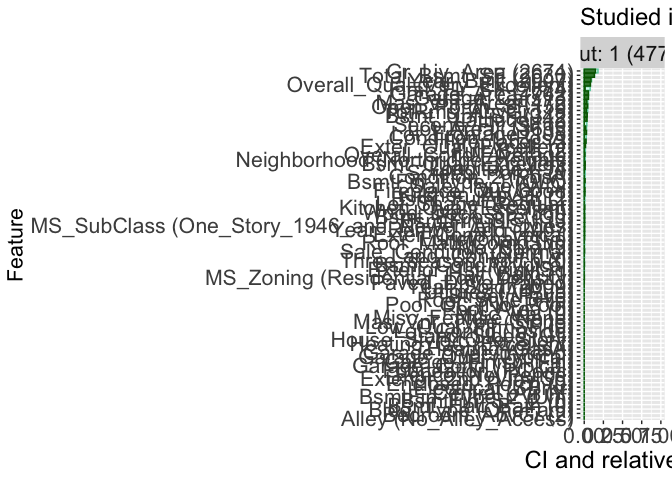

***Author**: Kary Främling, 23 May 2023.*

This is an [R Markdown](http://rmarkdown.rstudio.com) Notebook. When you
execute code within the notebook, the results appear beneath the code.
Code chunks are executed by clicking the *Run* button within the chunk
or by placing your cursor inside it and pressing *Cmd+Shift+Enter*.

## Counterfactual, Contrastive and Hierarchical Explanations with Contextual Importance and Utility

This R notebook produces the results shown in the paper “Counterfactual,
Contrastive and Hierarchical Explanations with Contextual Importance and
Utility” by Kary Främling, (to be) published in the proceedings of the
5<sup>th</sup> International Workshop on EXplainable and TRAnsparent AI
and Multi-Agent Systems (EXTRAAMAS 2023).

### Basic definitions

***Contextual Importance (CI)*** expresses to what extent modifying the
value of one or more feature(s) *x<sub>{i}</sub>* can affect the output
value *y<sub>j</sub>* (or rather the output utility
*u<sub>j</sub>(y<sub>j</sub>)*).

***Contextual Utility (CU)*** expresses to what extent the current
value(s) of given feature(s) contribute to obtaining a high output
utility *u<sub>j</sub>*.

***Contextual influence*** expresses how much feature(s) influence the
output value (utility) relative to a *reference value* or *baseline*.

*According to these definitions, methods such as Shapley value and LIME
produce influence values (not importance values).*

### Demonstration

The code here works with the CIU implementation at
<https://github.com/KaryFramling/ciu>, since the code push on 23 May
2023. Installation instructions are found there. An official package
release to CRAN with the newest functionality will be made later.

Once the CIU package has been installed, some preliminary setup:

``` r
library(ciu)
library(caret)
```

    ## Loading required package: ggplot2

    ## Loading required package: lattice

``` r
library(reshape2)
library(data.table)
```

    ## 
    ## Attaching package: 'data.table'

    ## The following objects are masked from 'package:reshape2':
    ## 
    ##     dcast, melt

``` r
# Common text sizes everywhere by own theme.
own_theme = theme(
  plot.title = element_text(size = 18),
  axis.title.x = element_text(size = 18),
  axis.text = element_text(size = 16),
  axis.title.y = element_text(size = 16),
  strip.text = element_text(size=16)
)

# Function for having only two decimals max in plots.
scaleFUN <- function(x) as.character(round(x, digits = 2))
```

### Counterfactual explanations and visualisation

We begin with some “counterfactual” explanations using CIU. The used
dataset is Titanic. We train a Random Forest model.

``` r
# We use the existing data set from the DALEX package and do some small pre-processing on it. 
library("DALEX")
```

    ## Welcome to DALEX (version: 2.4.3).
    ## Find examples and detailed introduction at: http://ema.drwhy.ai/
    ## Additional features will be available after installation of: ggpubr.
    ## Use 'install_dependencies()' to get all suggested dependencies

``` r
titanic_data <- titanic[,c("class", "gender", "age", "sibsp", "parch", "fare", "embarked", "survived")]
titanic_data$survived <- factor(titanic_data$survived)
titanic_data$gender <- factor(titanic_data$gender)
titanic_data$embarked <- factor(titanic_data$embarked)
titanic_data <- na.omit(titanic_data)

# Train Random Forest model. 
set.seed(42) # We want to be sure to always get same model
inTrain <- createDataPartition(y=titanic_data$survived, p=0.75, list=FALSE) # 75% to train set
titanic.train <- titanic_data[inTrain,]
titanic.validate <- titanic_data[-inTrain,]
kfoldcv <- trainControl(method="cv", number=10)
if ( !exists("titanic_rf") ) {
  titanic_rf <- caret::train(survived ~ ., titanic.train, method="rf", trControl=kfoldcv)
}
predictions <- predict(titanic_rf, newdata=titanic.validate)
# Show confusion Matrix and performance metrics
caret::confusionMatrix(predictions, titanic.validate$survived) 
```

    ## Confusion Matrix and Statistics
    ## 
    ##           Reference
    ## Prediction  no yes
    ##        no  340  76
    ##        yes  27 101
    ##                                           
    ##                Accuracy : 0.8107          
    ##                  95% CI : (0.7752, 0.8427)
    ##     No Information Rate : 0.6746          
    ##     P-Value [Acc > NIR] : 9.149e-13       
    ##                                           
    ##                   Kappa : 0.5354          
    ##                                           
    ##  Mcnemar's Test P-Value : 2.250e-06       
    ##                                           
    ##             Sensitivity : 0.9264          
    ##             Specificity : 0.5706          
    ##          Pos Pred Value : 0.8173          
    ##          Neg Pred Value : 0.7891          
    ##              Prevalence : 0.6746          
    ##          Detection Rate : 0.6250          
    ##    Detection Prevalence : 0.7647          
    ##       Balanced Accuracy : 0.7485          
    ##                                           
    ##        'Positive' Class : no              
    ## 

We use the instance”Johnny D”, from <https://ema.drwhy.ai>

``` r
new_passenger <- data.frame(
  class = factor("1st", levels = c("1st", "2nd", "3rd", "deck crew", "engineering crew", "restaurant staff", "victualling crew")),
  gender = factor("male", levels = c("female", "male")),
  age = 8,
  sibsp = 0,
  parch = 0,
  fare = 72,
  embarked = factor("Cherbourg", levels = c("Belfast", "Cherbourg", "Queenstown", "Southampton")),
  survived = factor("yes", levels = c("no", "yes"))
)
```

Then get CIU barplot explanation, first with CU value illustrated with
colour. CI value is shown by the bar length:

``` r
out.name <- "yes"
survival_probability <- predict(titanic_rf, new_passenger, type="prob")$yes
titanic_ciu <- ciu.new(titanic_rf, survived~., titanic.train)
titanic_ciu.meta <- titanic_ciu$meta.explain(new_passenger[,-ncol(titanic.train)])
p1 <- titanic_ciu$ggplot.col.ciu(new_passenger[,-ncol(titanic.train)], output.names = out.name, ciu.meta=titanic_ciu.meta) +
  labs(title="", x ="", y="CI", fill="CU") + own_theme
print(p1)
```

<!-- -->

We see that “age” is the most important feature and the value “8” is
good for the probability of survival. “Gender” is the second-most
important feature and being “male” reduces the probability of survival.

A more recent CIU visualization is more precise and “counterfactual”
(answering a “what-if” question) in nature:

``` r
p <- titanic_ciu$ggplot.col.ciu(new_passenger[,-ncol(titanic.train)], output.names = out.name, ciu.meta=titanic_ciu.meta, plot.mode = "overlap") +
  labs(title="", x ="", y="CI", fill="CU") + own_theme
print(p)
```

<!-- -->

This visualization illustrates more clearly that the number of
accompanying siblings (feature “sibsp”) and parents (feature “parch”)
are both quite important too. For the case of “Johnny D”, not having any
siblings is favorable for the probability of survival, whereas traveling
alone (“parch=0”) reduces the probability of survival. This kind of
insight would be useful for situations when there is a possibility to
actually change the values somehow, as in the case of not being accepted
to a school, not getting an employment or not getting a bank loan.

This plot can also be combined with colors:

``` r
p <- titanic_ciu$ggplot.col.ciu(new_passenger[,-ncol(titanic.train)], output.names = out.name, ciu.meta=titanic_ciu.meta, plot.mode = "overlap", cu.colours=NULL) +
  labs(title="", x ="", y="CI", fill="CU") + own_theme
print(p)
```

<!-- -->

How to best visualize explanations is a science of its own. CIU can also
give the same CIU explanation as text, as here (bold/italic etc effects
require using the “crayon” package):

``` r
cat(titanic_ciu$textual(new_passenger[,-ncol(titanic.train)], ciu.meta=titanic_ciu.meta, use.text.effects = TRUE))
```

    ## The value of output 'no' for instance '1' is 0.364, which is bad (CU=0.364).
    ## Feature 'age' is very important (CI=0.642) and value '8' is very bad (CU=0.103).
    ## Feature 'gender' is slightly important (CI=0.334) and value 'male' is very good (CU=1).
    ## Feature 'sibsp' is slightly important (CI=0.256) and value '0' is very bad (CU=0.008).
    ## Feature 'fare' is slightly important (CI=0.256) and value '72' is good (CU=0.719).
    ## Feature 'parch' is slightly important (CI=0.244) and value '0' is very good (CU=1).
    ## Feature 'class' is slightly important (CI=0.212) and value '1st' is bad (CU=0.302).
    ## Feature 'embarked' is not important (CI=0.074) and value 'Cherbourg' is very bad (CU=0).

The counterfactual explanations shown above are possible due to CIU’s
separation of (Contextual) **Importance** and **Utility**. It is also
possible to produce Contextual **influence** explanations, which is what
Shapley values, LIME and similar methods produce. Influence values are
always relative to a reference value or baseline, which is here called
“neutral.CU”. “neutral.CU” can be anything in the interval \[0,1\] and
the choice depends on what is considered a reference value for the
application at hand (which is not possible e.g. with Shapley value). In
order to simplify comparison with Shapley value, we here set
“neutral.CU” to the utility value of the average output probability of
survival (sorry for complicated phrase) and create the corresponding bar
plot, using the usual colors used in LIME implementations:

``` r
# Get average probability of survival, use as normal.CU
neutral.CU <- sum(titanic_data$survived==out.name)/nrow(titanic_data)
p2 <- titanic_ciu$ggplot.col.ciu(new_passenger[,-ncol(titanic.train)], output.names = out.name, ciu.meta=titanic_ciu.meta, use.influence=TRUE, neutral.CU=neutral.CU, low.color = "firebrick", high.color = "steelblue")
p2 <- p2 + labs(title="", x ="", y = expression(phi)) + own_theme +
  scale_y_continuous(labels=scaleFUN)
```

    ## Scale for y is already present.
    ## Adding another scale for y, which will replace the existing scale.

``` r
print(p2)
```

<!-- -->

It is possible to “explain” CI , CU and Contextual influence values
visually for one (or two if 3D) feature at a time. The following plot
shows how the probability of survival of “Johnny D” would evolve if
modifying the value of the feature “age” and the values used by CIU:

``` r
# Input-output plot for "age"
print(titanic_ciu$ggplot.ciu(new_passenger, ind.input = 3, ind.output = 2, neutral.CU = neutral.CU, illustrate.CIU=TRUE))
```

<!-- -->

The red dot shows the current value for “age” and the current
probability of survival. In this case, CI=(ymax-ymin)/(MAX-MIN) so “age”
is clearly very important. CU=(y-ymin)/(ymax-ymin) and it has a high
value, which corresponds to that the red dot is situated in the higher
part of the \[ymin,ymax\] range.

The contextual influence is quite high and positive, which can be seen
from the position of the red dot compared to the “y(u(0))” line in
orange.

**Global importance/influence/utility and Beeswarm visualisation**

Beeswarms give an overview of an entire data set by showing
CI/CU/influence values of every feature for every instance. As in
<https://github.com/slundberg/shap,> we use the Boston data set and a
Gradient  
Boosting model. We train the GBM first:

``` r
library(MASS)
library(ggbeeswarm)
kfoldcv <- trainControl(method="cv", number=10)
gbm <- caret::train(medv ~ ., Boston, method="gbm", trControl=kfoldcv)
```

    ## Iter   TrainDeviance   ValidDeviance   StepSize   Improve
    ##      1       79.0107             nan     0.1000    6.3057
    ##      2       72.5247             nan     0.1000    6.1374
    ##      3       66.9978             nan     0.1000    5.9344
    ##      4       62.3800             nan     0.1000    3.6923
    ##      5       58.8439             nan     0.1000    2.6723
    ##      6       54.6574             nan     0.1000    3.2442
    ##      7       50.4133             nan     0.1000    3.9770
    ##      8       47.1391             nan     0.1000    3.2579
    ##      9       44.2943             nan     0.1000    2.6182
    ##     10       41.6124             nan     0.1000    2.8125
    ##     20       25.8897             nan     0.1000    0.8993
    ##     40       16.6965             nan     0.1000    0.0506
    ##     60       13.7151             nan     0.1000    0.0511
    ##     80       12.3012             nan     0.1000   -0.2062
    ##    100       11.3400             nan     0.1000    0.0288
    ##    120       10.6431             nan     0.1000   -0.0076
    ##    140       10.1608             nan     0.1000    0.0056
    ##    150        9.9539             nan     0.1000    0.0058
    ## 
    ## Iter   TrainDeviance   ValidDeviance   StepSize   Improve
    ##      1       77.8745             nan     0.1000   10.4526
    ##      2       69.5786             nan     0.1000    8.6471
    ##      3       62.0751             nan     0.1000    7.4718
    ##      4       55.5973             nan     0.1000    5.4665
    ##      5       50.1006             nan     0.1000    5.7899
    ##      6       45.4010             nan     0.1000    3.9588
    ##      7       41.3203             nan     0.1000    3.6263
    ##      8       37.9742             nan     0.1000    2.6405
    ##      9       34.9311             nan     0.1000    2.3794
    ##     10       32.0420             nan     0.1000    2.7327
    ##     20       18.4111             nan     0.1000    0.6576
    ##     40       11.7766             nan     0.1000   -0.0254
    ##     60        9.5734             nan     0.1000   -0.0201
    ##     80        8.0921             nan     0.1000   -0.0326
    ##    100        7.4436             nan     0.1000   -0.0997
    ##    120        6.8689             nan     0.1000   -0.0024
    ##    140        6.2715             nan     0.1000   -0.0184
    ##    150        6.0450             nan     0.1000   -0.0155
    ## 
    ## Iter   TrainDeviance   ValidDeviance   StepSize   Improve
    ##      1       75.3013             nan     0.1000   12.5659
    ##      2       65.9789             nan     0.1000    8.8225
    ##      3       57.7083             nan     0.1000    8.7888
    ##      4       51.3376             nan     0.1000    5.8475
    ##      5       45.8822             nan     0.1000    5.5027
    ##      6       41.5991             nan     0.1000    4.0880
    ##      7       37.4201             nan     0.1000    3.9044
    ##      8       33.8362             nan     0.1000    2.7721
    ##      9       30.7575             nan     0.1000    2.2065
    ##     10       28.2537             nan     0.1000    2.3856
    ##     20       15.1310             nan     0.1000    0.5940
    ##     40        9.6965             nan     0.1000   -0.0188
    ##     60        7.9000             nan     0.1000   -0.0972
    ##     80        6.8360             nan     0.1000   -0.0295
    ##    100        6.0769             nan     0.1000   -0.0689
    ##    120        5.4309             nan     0.1000   -0.0330
    ##    140        4.9918             nan     0.1000   -0.0845
    ##    150        4.6957             nan     0.1000   -0.0601
    ## 
    ## Iter   TrainDeviance   ValidDeviance   StepSize   Improve
    ##      1       77.9667             nan     0.1000    6.9640
    ##      2       71.5344             nan     0.1000    4.7966
    ##      3       65.7323             nan     0.1000    4.2600
    ##      4       61.4925             nan     0.1000    2.8785
    ##      5       56.6752             nan     0.1000    4.9341
    ##      6       52.3543             nan     0.1000    4.0015
    ##      7       48.7601             nan     0.1000    3.3749
    ##      8       45.7499             nan     0.1000    2.7562
    ##      9       42.8301             nan     0.1000    2.7848
    ##     10       40.4278             nan     0.1000    1.5868
    ##     20       25.7856             nan     0.1000    0.6245
    ##     40       17.0273             nan     0.1000    0.1509
    ##     60       14.2063             nan     0.1000   -0.3446
    ##     80       12.4309             nan     0.1000    0.0019
    ##    100       11.5909             nan     0.1000   -0.0866
    ##    120       11.0382             nan     0.1000   -0.0084
    ##    140       10.5823             nan     0.1000   -0.0532
    ##    150       10.3810             nan     0.1000    0.0066
    ## 
    ## Iter   TrainDeviance   ValidDeviance   StepSize   Improve
    ##      1       74.8391             nan     0.1000    9.4646
    ##      2       66.2540             nan     0.1000    8.2319
    ##      3       58.2545             nan     0.1000    8.8465
    ##      4       52.6198             nan     0.1000    4.4861
    ##      5       47.4912             nan     0.1000    4.7654
    ##      6       44.0513             nan     0.1000    3.1608
    ##      7       39.5877             nan     0.1000    3.9552
    ##      8       36.0678             nan     0.1000    3.2875
    ##      9       32.9999             nan     0.1000    2.4722
    ##     10       30.7251             nan     0.1000    2.4321
    ##     20       17.4351             nan     0.1000    0.3395
    ##     40       11.7742             nan     0.1000    0.0043
    ##     60        9.9880             nan     0.1000   -0.0174
    ##     80        8.7111             nan     0.1000   -0.0587
    ##    100        7.7537             nan     0.1000   -0.0497
    ##    120        7.2328             nan     0.1000   -0.0608
    ##    140        6.7806             nan     0.1000   -0.0401
    ##    150        6.5878             nan     0.1000   -0.0051
    ## 
    ## Iter   TrainDeviance   ValidDeviance   StepSize   Improve
    ##      1       73.3639             nan     0.1000   10.8431
    ##      2       62.8603             nan     0.1000    8.9146
    ##      3       55.7634             nan     0.1000    6.2934
    ##      4       49.4837             nan     0.1000    4.9188
    ##      5       44.0860             nan     0.1000    4.1482
    ##      6       39.6806             nan     0.1000    4.2273
    ##      7       36.0516             nan     0.1000    3.6934
    ##      8       32.9920             nan     0.1000    3.0816
    ##      9       30.1983             nan     0.1000    2.8432
    ##     10       27.7968             nan     0.1000    1.8422
    ##     20       15.6245             nan     0.1000    0.4387
    ##     40       10.3074             nan     0.1000    0.0835
    ##     60        8.3045             nan     0.1000   -0.0827
    ##     80        6.9847             nan     0.1000   -0.0604
    ##    100        6.2431             nan     0.1000   -0.0323
    ##    120        5.5360             nan     0.1000   -0.0099
    ##    140        5.0136             nan     0.1000   -0.0635
    ##    150        4.7425             nan     0.1000   -0.0429
    ## 
    ## Iter   TrainDeviance   ValidDeviance   StepSize   Improve
    ##      1       74.1128             nan     0.1000    6.4395
    ##      2       67.5276             nan     0.1000    6.3323
    ##      3       62.3659             nan     0.1000    4.8023
    ##      4       58.2404             nan     0.1000    4.5163
    ##      5       53.7859             nan     0.1000    4.9441
    ##      6       49.7414             nan     0.1000    3.7032
    ##      7       46.7421             nan     0.1000    1.8313
    ##      8       43.6207             nan     0.1000    2.9288
    ##      9       40.8934             nan     0.1000    1.8227
    ##     10       38.5727             nan     0.1000    1.3680
    ##     20       23.2270             nan     0.1000    0.8628
    ##     40       14.8405             nan     0.1000    0.0342
    ##     60       12.7835             nan     0.1000    0.0083
    ##     80       11.6339             nan     0.1000   -0.0050
    ##    100       10.8792             nan     0.1000   -0.1525
    ##    120       10.2905             nan     0.1000   -0.0097
    ##    140        9.8851             nan     0.1000   -0.0090
    ##    150        9.7150             nan     0.1000   -0.0888
    ## 
    ## Iter   TrainDeviance   ValidDeviance   StepSize   Improve
    ##      1       72.0520             nan     0.1000    9.6412
    ##      2       64.6635             nan     0.1000    7.9477
    ##      3       57.5827             nan     0.1000    7.5907
    ##      4       51.4072             nan     0.1000    5.3615
    ##      5       45.6694             nan     0.1000    6.1834
    ##      6       41.1877             nan     0.1000    3.1888
    ##      7       37.4090             nan     0.1000    3.4688
    ##      8       34.2151             nan     0.1000    3.4648
    ##      9       31.2526             nan     0.1000    2.5514
    ##     10       28.7441             nan     0.1000    1.8705
    ##     20       16.9002             nan     0.1000    0.5035
    ##     40       11.2631             nan     0.1000    0.0667
    ##     60        9.2820             nan     0.1000    0.0083
    ##     80        8.3302             nan     0.1000    0.0314
    ##    100        7.3614             nan     0.1000   -0.0391
    ##    120        6.7398             nan     0.1000   -0.0300
    ##    140        6.3306             nan     0.1000   -0.0323
    ##    150        6.0174             nan     0.1000   -0.0306
    ## 
    ## Iter   TrainDeviance   ValidDeviance   StepSize   Improve
    ##      1       70.8609             nan     0.1000   11.3696
    ##      2       61.7251             nan     0.1000    8.6632
    ##      3       53.6897             nan     0.1000    5.8691
    ##      4       47.4419             nan     0.1000    5.9138
    ##      5       42.7640             nan     0.1000    4.7787
    ##      6       38.6564             nan     0.1000    4.2666
    ##      7       34.9077             nan     0.1000    2.9589
    ##      8       32.1925             nan     0.1000    2.5916
    ##      9       29.1847             nan     0.1000    2.6166
    ##     10       26.5728             nan     0.1000    2.1956
    ##     20       14.2071             nan     0.1000    0.5465
    ##     40        9.1440             nan     0.1000   -0.1764
    ##     60        7.3202             nan     0.1000    0.0382
    ##     80        6.3219             nan     0.1000   -0.1400
    ##    100        5.5789             nan     0.1000   -0.0448
    ##    120        5.0097             nan     0.1000   -0.0154
    ##    140        4.5184             nan     0.1000   -0.0122
    ##    150        4.2960             nan     0.1000   -0.0337
    ## 
    ## Iter   TrainDeviance   ValidDeviance   StepSize   Improve
    ##      1       74.5852             nan     0.1000    6.5471
    ##      2       68.5367             nan     0.1000    5.8560
    ##      3       63.3888             nan     0.1000    5.1630
    ##      4       59.3638             nan     0.1000    4.0781
    ##      5       54.8585             nan     0.1000    3.3735
    ##      6       50.8462             nan     0.1000    3.7908
    ##      7       47.5828             nan     0.1000    2.9966
    ##      8       44.5214             nan     0.1000    2.2323
    ##      9       42.1718             nan     0.1000    2.1187
    ##     10       39.3964             nan     0.1000    2.2897
    ##     20       25.4246             nan     0.1000    0.5897
    ##     40       16.7037             nan     0.1000    0.1341
    ##     60       14.0896             nan     0.1000    0.0538
    ##     80       12.5468             nan     0.1000    0.0306
    ##    100       11.6419             nan     0.1000    0.0079
    ##    120       11.1395             nan     0.1000   -0.0182
    ##    140       10.6648             nan     0.1000   -0.0575
    ##    150       10.4185             nan     0.1000   -0.0464
    ## 
    ## Iter   TrainDeviance   ValidDeviance   StepSize   Improve
    ##      1       72.0595             nan     0.1000    9.4374
    ##      2       64.1142             nan     0.1000    8.6263
    ##      3       56.9661             nan     0.1000    6.3931
    ##      4       50.7885             nan     0.1000    5.4996
    ##      5       45.7933             nan     0.1000    4.6858
    ##      6       41.7490             nan     0.1000    3.9355
    ##      7       38.2127             nan     0.1000    3.1567
    ##      8       35.4103             nan     0.1000    2.4296
    ##      9       32.6764             nan     0.1000    2.7681
    ##     10       30.6694             nan     0.1000    2.0600
    ##     20       17.8473             nan     0.1000    0.3650
    ##     40       11.5794             nan     0.1000    0.0566
    ##     60        9.7081             nan     0.1000    0.0470
    ##     80        8.6425             nan     0.1000   -0.1582
    ##    100        7.8195             nan     0.1000   -0.0290
    ##    120        7.2097             nan     0.1000   -0.0490
    ##    140        6.5895             nan     0.1000   -0.0579
    ##    150        6.3246             nan     0.1000   -0.0173
    ## 
    ## Iter   TrainDeviance   ValidDeviance   StepSize   Improve
    ##      1       70.0048             nan     0.1000    8.1486
    ##      2       61.4132             nan     0.1000    8.8094
    ##      3       54.3912             nan     0.1000    7.5022
    ##      4       48.3595             nan     0.1000    5.2082
    ##      5       43.4132             nan     0.1000    3.6265
    ##      6       38.7133             nan     0.1000    3.6841
    ##      7       34.8804             nan     0.1000    3.2514
    ##      8       31.3199             nan     0.1000    3.6922
    ##      9       28.6530             nan     0.1000    2.1658
    ##     10       26.4185             nan     0.1000    1.8915
    ##     20       14.6414             nan     0.1000    0.6061
    ##     40        9.7952             nan     0.1000    0.0036
    ##     60        7.9023             nan     0.1000    0.0315
    ##     80        6.8496             nan     0.1000   -0.0384
    ##    100        6.1039             nan     0.1000   -0.0403
    ##    120        5.4857             nan     0.1000   -0.0290
    ##    140        4.9711             nan     0.1000   -0.0158
    ##    150        4.7723             nan     0.1000   -0.0166
    ## 
    ## Iter   TrainDeviance   ValidDeviance   StepSize   Improve
    ##      1       72.3103             nan     0.1000    6.6208
    ##      2       65.9018             nan     0.1000    6.8786
    ##      3       60.1151             nan     0.1000    5.6867
    ##      4       55.5082             nan     0.1000    4.3852
    ##      5       51.1169             nan     0.1000    3.0885
    ##      6       47.7763             nan     0.1000    3.2701
    ##      7       44.5633             nan     0.1000    2.7427
    ##      8       41.4559             nan     0.1000    2.2555
    ##      9       38.6171             nan     0.1000    2.3234
    ##     10       36.3353             nan     0.1000    2.0806
    ##     20       22.7308             nan     0.1000    0.6384
    ##     40       14.2989             nan     0.1000    0.1305
    ##     60       11.9421             nan     0.1000   -0.0435
    ##     80       10.7722             nan     0.1000    0.0288
    ##    100       10.0059             nan     0.1000   -0.0336
    ##    120        9.4780             nan     0.1000    0.0084
    ##    140        9.0899             nan     0.1000   -0.0370
    ##    150        8.9002             nan     0.1000   -0.0125
    ## 
    ## Iter   TrainDeviance   ValidDeviance   StepSize   Improve
    ##      1       70.2785             nan     0.1000    9.6395
    ##      2       62.4641             nan     0.1000    7.1069
    ##      3       54.9602             nan     0.1000    7.0250
    ##      4       48.4676             nan     0.1000    6.5455
    ##      5       43.3593             nan     0.1000    4.9193
    ##      6       38.6813             nan     0.1000    3.9868
    ##      7       35.6662             nan     0.1000    3.2863
    ##      8       32.3847             nan     0.1000    2.3237
    ##      9       29.7493             nan     0.1000    2.8673
    ##     10       27.7293             nan     0.1000    2.0174
    ##     20       16.0776             nan     0.1000    0.3299
    ##     40       10.7266             nan     0.1000   -0.1178
    ##     60        8.9892             nan     0.1000    0.0220
    ##     80        7.7965             nan     0.1000    0.0314
    ##    100        7.2274             nan     0.1000   -0.1072
    ##    120        6.6746             nan     0.1000   -0.0493
    ##    140        6.2579             nan     0.1000   -0.0224
    ##    150        6.0564             nan     0.1000   -0.0365
    ## 
    ## Iter   TrainDeviance   ValidDeviance   StepSize   Improve
    ##      1       68.7790             nan     0.1000    9.6714
    ##      2       60.1053             nan     0.1000    8.1138
    ##      3       52.9942             nan     0.1000    8.1860
    ##      4       46.5108             nan     0.1000    5.1805
    ##      5       41.2598             nan     0.1000    4.6983
    ##      6       37.1598             nan     0.1000    3.5899
    ##      7       33.3480             nan     0.1000    3.6918
    ##      8       30.1484             nan     0.1000    2.5977
    ##      9       27.7589             nan     0.1000    2.4234
    ##     10       25.2907             nan     0.1000    2.2369
    ##     20       14.1123             nan     0.1000    0.2782
    ##     40        9.3357             nan     0.1000    0.0656
    ##     60        7.7165             nan     0.1000   -0.1265
    ##     80        6.4352             nan     0.1000   -0.0532
    ##    100        5.7821             nan     0.1000   -0.0305
    ##    120        5.1726             nan     0.1000   -0.0482
    ##    140        4.6523             nan     0.1000   -0.0523
    ##    150        4.4236             nan     0.1000   -0.0342
    ## 
    ## Iter   TrainDeviance   ValidDeviance   StepSize   Improve
    ##      1       77.3156             nan     0.1000    7.1229
    ##      2       70.7600             nan     0.1000    5.4765
    ##      3       64.2788             nan     0.1000    5.5815
    ##      4       59.6103             nan     0.1000    4.7454
    ##      5       55.3228             nan     0.1000    4.3441
    ##      6       52.0844             nan     0.1000    3.1122
    ##      7       48.1430             nan     0.1000    3.1724
    ##      8       45.1331             nan     0.1000    2.9311
    ##      9       42.3887             nan     0.1000    1.6083
    ##     10       40.0235             nan     0.1000    2.2409
    ##     20       25.5006             nan     0.1000    0.7084
    ##     40       16.7345             nan     0.1000    0.0472
    ##     60       13.7986             nan     0.1000    0.0666
    ##     80       12.2011             nan     0.1000    0.0535
    ##    100       11.4362             nan     0.1000   -0.0481
    ##    120       10.7870             nan     0.1000   -0.0124
    ##    140       10.3791             nan     0.1000   -0.1246
    ##    150       10.2026             nan     0.1000   -0.0265
    ## 
    ## Iter   TrainDeviance   ValidDeviance   StepSize   Improve
    ##      1       75.3730             nan     0.1000   10.8227
    ##      2       67.3573             nan     0.1000    7.7707
    ##      3       60.0925             nan     0.1000    7.2003
    ##      4       54.2308             nan     0.1000    5.8663
    ##      5       49.0256             nan     0.1000    5.0603
    ##      6       44.4033             nan     0.1000    3.9186
    ##      7       40.4982             nan     0.1000    3.6995
    ##      8       36.6659             nan     0.1000    2.8837
    ##      9       33.6400             nan     0.1000    2.0618
    ##     10       31.3675             nan     0.1000    1.7239
    ##     20       18.5131             nan     0.1000    0.6157
    ##     40       11.9800             nan     0.1000    0.0239
    ##     60        9.8097             nan     0.1000   -0.0782
    ##     80        8.7469             nan     0.1000   -0.0303
    ##    100        7.9397             nan     0.1000   -0.0210
    ##    120        7.3295             nan     0.1000   -0.0709
    ##    140        6.8087             nan     0.1000   -0.0392
    ##    150        6.5154             nan     0.1000   -0.0140
    ## 
    ## Iter   TrainDeviance   ValidDeviance   StepSize   Improve
    ##      1       73.6303             nan     0.1000   10.9874
    ##      2       63.8836             nan     0.1000    8.3779
    ##      3       55.9479             nan     0.1000    6.8385
    ##      4       50.2122             nan     0.1000    6.3114
    ##      5       44.8943             nan     0.1000    4.2262
    ##      6       40.3098             nan     0.1000    4.6498
    ##      7       36.5198             nan     0.1000    2.8028
    ##      8       33.6346             nan     0.1000    2.6657
    ##      9       30.7282             nan     0.1000    2.6078
    ##     10       28.4549             nan     0.1000    1.8937
    ##     20       16.0521             nan     0.1000    0.3907
    ##     40       10.0818             nan     0.1000    0.0811
    ##     60        8.2911             nan     0.1000   -0.0585
    ##     80        7.2711             nan     0.1000    0.0428
    ##    100        6.4938             nan     0.1000    0.0178
    ##    120        5.8341             nan     0.1000   -0.0315
    ##    140        5.3587             nan     0.1000   -0.0676
    ##    150        5.1056             nan     0.1000   -0.0137
    ## 
    ## Iter   TrainDeviance   ValidDeviance   StepSize   Improve
    ##      1       79.5308             nan     0.1000    7.0869
    ##      2       72.5090             nan     0.1000    6.6672
    ##      3       66.3751             nan     0.1000    4.4278
    ##      4       60.8540             nan     0.1000    3.8323
    ##      5       56.4854             nan     0.1000    4.3323
    ##      6       52.6824             nan     0.1000    3.6698
    ##      7       49.6955             nan     0.1000    2.8231
    ##      8       46.6679             nan     0.1000    3.0397
    ##      9       44.1609             nan     0.1000    2.3942
    ##     10       41.8402             nan     0.1000    2.3459
    ##     20       26.6004             nan     0.1000    0.7305
    ##     40       17.2588             nan     0.1000   -0.0026
    ##     60       14.3562             nan     0.1000   -0.0414
    ##     80       12.8517             nan     0.1000    0.0192
    ##    100       11.9160             nan     0.1000   -0.0205
    ##    120       11.3624             nan     0.1000   -0.0305
    ##    140       10.8791             nan     0.1000   -0.0077
    ##    150       10.6167             nan     0.1000   -0.0732
    ## 
    ## Iter   TrainDeviance   ValidDeviance   StepSize   Improve
    ##      1       76.7290             nan     0.1000    9.8998
    ##      2       68.4010             nan     0.1000    8.7265
    ##      3       61.3403             nan     0.1000    7.4737
    ##      4       54.5648             nan     0.1000    7.0641
    ##      5       48.7537             nan     0.1000    5.3527
    ##      6       44.0306             nan     0.1000    4.0238
    ##      7       39.8288             nan     0.1000    4.2641
    ##      8       36.3867             nan     0.1000    2.7126
    ##      9       33.4465             nan     0.1000    2.7298
    ##     10       31.1639             nan     0.1000    2.0191
    ##     20       18.8859             nan     0.1000    0.8010
    ##     40       12.3138             nan     0.1000    0.0369
    ##     60       10.3627             nan     0.1000   -0.0572
    ##     80        9.1374             nan     0.1000   -0.0280
    ##    100        8.2678             nan     0.1000   -0.0104
    ##    120        7.2855             nan     0.1000    0.0222
    ##    140        6.6641             nan     0.1000   -0.0173
    ##    150        6.3650             nan     0.1000   -0.0303
    ## 
    ## Iter   TrainDeviance   ValidDeviance   StepSize   Improve
    ##      1       75.5929             nan     0.1000   11.0551
    ##      2       65.7794             nan     0.1000    8.3892
    ##      3       57.7120             nan     0.1000    7.2387
    ##      4       50.7148             nan     0.1000    6.9001
    ##      5       45.8120             nan     0.1000    4.6657
    ##      6       41.0691             nan     0.1000    4.6141
    ##      7       37.1245             nan     0.1000    4.4852
    ##      8       34.0394             nan     0.1000    2.5825
    ##      9       31.2136             nan     0.1000    2.2800
    ##     10       28.4122             nan     0.1000    2.5015
    ##     20       16.2951             nan     0.1000    0.4465
    ##     40        9.9379             nan     0.1000   -0.0673
    ##     60        8.0757             nan     0.1000   -0.1396
    ##     80        6.9072             nan     0.1000   -0.0587
    ##    100        6.1299             nan     0.1000    0.0011
    ##    120        5.5773             nan     0.1000   -0.0364
    ##    140        5.0122             nan     0.1000   -0.0024
    ##    150        4.7631             nan     0.1000   -0.0358
    ## 
    ## Iter   TrainDeviance   ValidDeviance   StepSize   Improve
    ##      1       79.5716             nan     0.1000    5.8355
    ##      2       72.9311             nan     0.1000    6.7950
    ##      3       67.1735             nan     0.1000    5.8574
    ##      4       61.9807             nan     0.1000    4.1907
    ##      5       57.6676             nan     0.1000    4.2355
    ##      6       53.6788             nan     0.1000    2.3161
    ##      7       50.4473             nan     0.1000    3.0474
    ##      8       46.9617             nan     0.1000    3.3570
    ##      9       43.9108             nan     0.1000    2.6243
    ##     10       40.9371             nan     0.1000    2.7586
    ##     20       25.1162             nan     0.1000    0.8752
    ##     40       16.0281             nan     0.1000    0.0918
    ##     60       13.1064             nan     0.1000   -0.0111
    ##     80       11.6920             nan     0.1000   -0.0160
    ##    100       10.9934             nan     0.1000    0.0105
    ##    120       10.3083             nan     0.1000   -0.0669
    ##    140        9.9198             nan     0.1000   -0.0242
    ##    150        9.7623             nan     0.1000    0.0048
    ## 
    ## Iter   TrainDeviance   ValidDeviance   StepSize   Improve
    ##      1       75.4586             nan     0.1000   11.8703
    ##      2       66.5295             nan     0.1000    7.9989
    ##      3       59.3333             nan     0.1000    6.9108
    ##      4       52.8997             nan     0.1000    5.3543
    ##      5       48.0450             nan     0.1000    5.4878
    ##      6       43.4819             nan     0.1000    4.7337
    ##      7       39.2347             nan     0.1000    4.3344
    ##      8       36.5063             nan     0.1000    1.9434
    ##      9       33.3253             nan     0.1000    2.3968
    ##     10       30.7562             nan     0.1000    2.6681
    ##     20       18.4767             nan     0.1000    0.6034
    ##     40       11.6850             nan     0.1000    0.0588
    ##     60        9.5222             nan     0.1000   -0.0354
    ##     80        8.5690             nan     0.1000   -0.0272
    ##    100        7.6831             nan     0.1000   -0.0583
    ##    120        7.0013             nan     0.1000   -0.0058
    ##    140        6.4470             nan     0.1000   -0.0251
    ##    150        6.2085             nan     0.1000   -0.0242
    ## 
    ## Iter   TrainDeviance   ValidDeviance   StepSize   Improve
    ##      1       74.6888             nan     0.1000   12.3418
    ##      2       64.8569             nan     0.1000    7.7796
    ##      3       56.9056             nan     0.1000    7.6768
    ##      4       50.2562             nan     0.1000    6.3328
    ##      5       44.0596             nan     0.1000    5.6023
    ##      6       39.4806             nan     0.1000    4.0651
    ##      7       35.8525             nan     0.1000    3.4250
    ##      8       32.7079             nan     0.1000    3.4087
    ##      9       29.8217             nan     0.1000    2.6613
    ##     10       27.6662             nan     0.1000    2.0724
    ##     20       14.3951             nan     0.1000    0.4147
    ##     40        8.6422             nan     0.1000   -0.0242
    ##     60        6.8868             nan     0.1000   -0.0413
    ##     80        5.8925             nan     0.1000   -0.0662
    ##    100        5.3273             nan     0.1000   -0.0363
    ##    120        4.6881             nan     0.1000   -0.0229
    ##    140        4.2636             nan     0.1000   -0.0776
    ##    150        4.0911             nan     0.1000   -0.0154
    ## 
    ## Iter   TrainDeviance   ValidDeviance   StepSize   Improve
    ##      1       75.9775             nan     0.1000    6.9226
    ##      2       68.9133             nan     0.1000    5.0863
    ##      3       64.3856             nan     0.1000    3.4197
    ##      4       58.7609             nan     0.1000    4.9550
    ##      5       54.5360             nan     0.1000    3.9353
    ##      6       50.5165             nan     0.1000    3.1904
    ##      7       46.8737             nan     0.1000    3.1246
    ##      8       43.8884             nan     0.1000    2.9227
    ##      9       41.0526             nan     0.1000    3.0983
    ##     10       38.6011             nan     0.1000    2.2311
    ##     20       24.3400             nan     0.1000    0.6922
    ##     40       15.9803             nan     0.1000    0.0582
    ##     60       13.3400             nan     0.1000   -0.0347
    ##     80       12.0167             nan     0.1000   -0.0042
    ##    100       11.1798             nan     0.1000   -0.0404
    ##    120       10.6215             nan     0.1000   -0.0715
    ##    140       10.2171             nan     0.1000   -0.0193
    ##    150       10.0953             nan     0.1000   -0.1219
    ## 
    ## Iter   TrainDeviance   ValidDeviance   StepSize   Improve
    ##      1       73.0653             nan     0.1000    9.9140
    ##      2       64.8517             nan     0.1000    8.0487
    ##      3       57.6317             nan     0.1000    6.4740
    ##      4       52.1368             nan     0.1000    5.0417
    ##      5       46.8622             nan     0.1000    4.3722
    ##      6       41.9578             nan     0.1000    3.8530
    ##      7       38.2105             nan     0.1000    3.1146
    ##      8       34.9184             nan     0.1000    2.9269
    ##      9       32.1439             nan     0.1000    2.2472
    ##     10       29.7235             nan     0.1000    1.5425
    ##     20       18.1236             nan     0.1000    0.5123
    ##     40       11.7510             nan     0.1000   -0.1772
    ##     60       10.0630             nan     0.1000    0.0304
    ##     80        8.8871             nan     0.1000   -0.0504
    ##    100        7.9819             nan     0.1000    0.0001
    ##    120        7.3012             nan     0.1000   -0.0343
    ##    140        6.7056             nan     0.1000   -0.0294
    ##    150        6.4893             nan     0.1000   -0.0315
    ## 
    ## Iter   TrainDeviance   ValidDeviance   StepSize   Improve
    ##      1       72.3764             nan     0.1000    9.9814
    ##      2       63.1979             nan     0.1000    7.2536
    ##      3       54.8807             nan     0.1000    9.1627
    ##      4       49.1522             nan     0.1000    5.9775
    ##      5       43.5517             nan     0.1000    4.8816
    ##      6       38.7199             nan     0.1000    4.4380
    ##      7       35.5127             nan     0.1000    3.2637
    ##      8       32.1230             nan     0.1000    2.8260
    ##      9       29.1998             nan     0.1000    2.7854
    ##     10       26.8156             nan     0.1000    2.2479
    ##     20       15.4856             nan     0.1000    0.2799
    ##     40       10.1601             nan     0.1000    0.0241
    ##     60        8.0070             nan     0.1000   -0.0417
    ##     80        6.9369             nan     0.1000   -0.0062
    ##    100        5.9509             nan     0.1000   -0.0495
    ##    120        5.1378             nan     0.1000   -0.0131
    ##    140        4.6511             nan     0.1000   -0.0213
    ##    150        4.3937             nan     0.1000   -0.0273
    ## 
    ## Iter   TrainDeviance   ValidDeviance   StepSize   Improve
    ##      1       80.6473             nan     0.1000    7.5898
    ##      2       74.2029             nan     0.1000    6.0946
    ##      3       68.4134             nan     0.1000    5.8755
    ##      4       62.2062             nan     0.1000    5.4106
    ##      5       58.0514             nan     0.1000    3.8776
    ##      6       53.7209             nan     0.1000    4.4612
    ##      7       49.6940             nan     0.1000    3.3010
    ##      8       46.7047             nan     0.1000    2.7332
    ##      9       43.4047             nan     0.1000    2.8623
    ##     10       40.7501             nan     0.1000    2.0782
    ##     20       24.9249             nan     0.1000    0.6661
    ##     40       16.6664             nan     0.1000   -0.1022
    ##     60       13.7353             nan     0.1000    0.0799
    ##     80       12.3060             nan     0.1000   -0.0055
    ##    100       11.5005             nan     0.1000    0.0223
    ##    120       10.9808             nan     0.1000   -0.0653
    ##    140       10.5318             nan     0.1000   -0.0053
    ##    150       10.3574             nan     0.1000   -0.1056
    ## 
    ## Iter   TrainDeviance   ValidDeviance   StepSize   Improve
    ##      1       78.2978             nan     0.1000    9.3084
    ##      2       69.3117             nan     0.1000    8.2943
    ##      3       61.8971             nan     0.1000    7.4612
    ##      4       54.6314             nan     0.1000    6.1208
    ##      5       49.7097             nan     0.1000    5.2490
    ##      6       44.9789             nan     0.1000    4.5642
    ##      7       40.4159             nan     0.1000    4.2093
    ##      8       37.1337             nan     0.1000    3.0426
    ##      9       33.9199             nan     0.1000    3.2048
    ##     10       30.9886             nan     0.1000    2.4709
    ##     20       17.3945             nan     0.1000    0.7263
    ##     40       10.8937             nan     0.1000    0.1037
    ##     60        9.0945             nan     0.1000   -0.0239
    ##     80        8.2955             nan     0.1000    0.0005
    ##    100        7.7878             nan     0.1000   -0.0500
    ##    120        7.2283             nan     0.1000   -0.0467
    ##    140        6.7096             nan     0.1000   -0.0176
    ##    150        6.4996             nan     0.1000    0.0086
    ## 
    ## Iter   TrainDeviance   ValidDeviance   StepSize   Improve
    ##      1       75.9630             nan     0.1000   12.9676
    ##      2       66.7610             nan     0.1000    8.7917
    ##      3       58.3618             nan     0.1000    8.2492
    ##      4       51.6662             nan     0.1000    7.4264
    ##      5       46.3886             nan     0.1000    4.0692
    ##      6       40.7123             nan     0.1000    5.3543
    ##      7       36.2412             nan     0.1000    3.7539
    ##      8       32.9565             nan     0.1000    3.2512
    ##      9       30.1324             nan     0.1000    2.8312
    ##     10       27.6091             nan     0.1000    2.1673
    ##     20       14.8481             nan     0.1000    0.4585
    ##     40        9.3610             nan     0.1000   -0.1108
    ##     60        7.8688             nan     0.1000   -0.0746
    ##     80        6.7747             nan     0.1000    0.0055
    ##    100        5.8226             nan     0.1000   -0.0152
    ##    120        5.3080             nan     0.1000   -0.0431
    ##    140        4.8301             nan     0.1000   -0.0672
    ##    150        4.5809             nan     0.1000   -0.0356
    ## 
    ## Iter   TrainDeviance   ValidDeviance   StepSize   Improve
    ##      1       73.6923             nan     0.1000   11.1736
    ##      2       63.8483             nan     0.1000    6.9841
    ##      3       56.4635             nan     0.1000    6.4569
    ##      4       49.7952             nan     0.1000    6.1526
    ##      5       44.2525             nan     0.1000    4.6595
    ##      6       39.2826             nan     0.1000    4.3282
    ##      7       35.6673             nan     0.1000    3.4031
    ##      8       32.1582             nan     0.1000    3.3229
    ##      9       29.3588             nan     0.1000    2.5850
    ##     10       27.0050             nan     0.1000    2.2266
    ##     20       14.8592             nan     0.1000    0.3435
    ##     40        9.1797             nan     0.1000    0.0976
    ##     60        7.3660             nan     0.1000   -0.0043
    ##     80        6.5052             nan     0.1000   -0.0491
    ##    100        5.7829             nan     0.1000   -0.0122
    ##    120        5.2467             nan     0.1000   -0.0128
    ##    140        4.8872             nan     0.1000   -0.0438
    ##    150        4.6841             nan     0.1000   -0.0314

The we show CI values. The dot color represents the feature value. This
takes a little while (maybe something like 30 seconds):

``` r
ciu <- ciu.new(gbm, medv~., Boston)
df <- ciu.explain.long.data.frame(ciu)
p <- ciu.plots.beeswarm(df); print(p)
```

<!-- -->

The CI beeswarm reveals for example that the higher the value of "lstat"
(%lower status of the population), the higher is the CI
(contextual/instance-specific importance) of "lstat".

Next, we produce the corresponding beeswarm for Contextual influence
values:

``` r
mean.utility <- (mean(Boston$medv)-min(Boston$medv))/(max(Boston$medv)-min(Boston$medv))
df <- ciu.explain.long.data.frame(ciu, neutral.CU=mean.utility)
p <- ciu.plots.beeswarm(df, c("Feature","Influence","Norm.Value")); print(p)
```

<!-- -->

The influence plot reveals that a high "lstat" value lowers the
predicted home price and is nearly identical to the one produced for
Shapley values. We use normal.CU = 0.390, which corresponds to the
average price so the reference value is the same as for the Shapley
value and this plot is indeed almost identical to the one shown at
<https://github.com/slundberg/shap>. *(By now, it should also be clear
that “importance” is not the same thing as “influence”)*.

We can also display a CU beeswarm:

``` r
p <- ciu.plots.beeswarm(df, c("Feature","CU","Norm.Value")); print(p)
```

<!-- -->

The CU plot essentially shows the correlation between feature values and
utility values. For instancce, we can see that a high “crim” value gives
a low CU value, so high criminality is obviously not good for the estate
value.

### Intermediate Concepts

Ames housing is a data set with 2930 houses described by 81 features. A
gradient boosting model was trained to predict the sale price based on
the 80 other features. With 80 features a "classical" bar plot
explanation becomes unreadable. We first train a GBM model:

``` r
# Use ready-made AmesHousing R package
#install.packages("AmesHousing")
library(AmesHousing)
ames <- data.frame(make_ames())

# Training
set.seed(22) # We always want to get same result here for consistency between values, graphs, ...
target <- 'Sale_Price'
trainIdx <- createDataPartition(ames[,target], p=0.8, list=FALSE)
trainData = ames[trainIdx,]
testData = ames[-trainIdx,]

kfoldcv <- trainControl(method="cv", number=10)
exec.time <- system.time(
  Ames.gbm.caret <<- train(Sale_Price~., trainData, method="gbm", trControl=kfoldcv))
```

    ## Warning in (function (x, y, offset = NULL, misc = NULL, distribution =
    ## "bernoulli", : variable 12: MS_SubClassOne_and_Half_Story_PUD_All_Ages has no
    ## variation.

    ## Warning in (function (x, y, offset = NULL, misc = NULL, distribution =
    ## "bernoulli", : variable 21: MS_ZoningI_all has no variation.

    ## Warning in (function (x, y, offset = NULL, misc = NULL, distribution =
    ## "bernoulli", : variable 34: UtilitiesNoSewr has no variation.

    ## Warning in (function (x, y, offset = NULL, misc = NULL, distribution =
    ## "bernoulli", : variable 67: NeighborhoodLandmark has no variation.

    ## Warning in (function (x, y, offset = NULL, misc = NULL, distribution =
    ## "bernoulli", : variable 68: NeighborhoodHayden_Lake has no variation.

    ## Warning in (function (x, y, offset = NULL, misc = NULL, distribution =
    ## "bernoulli", : variable 112: Overall_CondVery_Excellent has no variation.

    ## Warning in (function (x, y, offset = NULL, misc = NULL, distribution =
    ## "bernoulli", : variable 123: Roof_MatlRoll has no variation.

    ## Warning in (function (x, y, offset = NULL, misc = NULL, distribution =
    ## "bernoulli", : variable 219: ElectricalUnknown has no variation.

    ## Warning in (function (x, y, offset = NULL, misc = NULL, distribution =
    ## "bernoulli", : variable 277: Pool_QCFair has no variation.

    ## Warning in (function (x, y, offset = NULL, misc = NULL, distribution =
    ## "bernoulli", : variable 289: Misc_FeatureTenC has no variation.

    ## Warning in (function (x, y, offset = NULL, misc = NULL, distribution =
    ## "bernoulli", : variable 300: Sale_TypeVWD has no variation.

    ## Iter   TrainDeviance   ValidDeviance   StepSize   Improve
    ##      1 5858528664.8702             nan     0.1000 504302442.1045
    ##      2 5449894964.8122             nan     0.1000 402029716.5079
    ##      3 5120515542.7609             nan     0.1000 308360015.5632
    ##      4 4797424680.1706             nan     0.1000 330405014.4552
    ##      5 4486053392.0356             nan     0.1000 311284534.9323
    ##      6 4210437528.8660             nan     0.1000 263324408.4190
    ##      7 3981103472.7934             nan     0.1000 223626362.9123
    ##      8 3766625322.3502             nan     0.1000 210219998.4836
    ##      9 3566495060.0897             nan     0.1000 180449211.8534
    ##     10 3399334640.9335             nan     0.1000 169612314.5266
    ##     20 2239842646.8527             nan     0.1000 62031198.9493
    ##     40 1403006988.5672             nan     0.1000 26749240.4365
    ##     60 1097300453.4143             nan     0.1000 8578281.7614
    ##     80 959274118.2271             nan     0.1000 5440377.6663
    ##    100 871318198.6473             nan     0.1000 2714141.2622
    ##    120 819103635.6866             nan     0.1000 2449690.5719
    ##    140 780376636.0134             nan     0.1000 -1241059.9948
    ##    150 765416649.1480             nan     0.1000 -5235351.2427

    ## Warning in (function (x, y, offset = NULL, misc = NULL, distribution =
    ## "bernoulli", : variable 12: MS_SubClassOne_and_Half_Story_PUD_All_Ages has no
    ## variation.

    ## Warning in (function (x, y, offset = NULL, misc = NULL, distribution =
    ## "bernoulli", : variable 21: MS_ZoningI_all has no variation.

    ## Warning in (function (x, y, offset = NULL, misc = NULL, distribution =
    ## "bernoulli", : variable 34: UtilitiesNoSewr has no variation.

    ## Warning in (function (x, y, offset = NULL, misc = NULL, distribution =
    ## "bernoulli", : variable 67: NeighborhoodLandmark has no variation.

    ## Warning in (function (x, y, offset = NULL, misc = NULL, distribution =
    ## "bernoulli", : variable 68: NeighborhoodHayden_Lake has no variation.

    ## Warning in (function (x, y, offset = NULL, misc = NULL, distribution =
    ## "bernoulli", : variable 112: Overall_CondVery_Excellent has no variation.

    ## Warning in (function (x, y, offset = NULL, misc = NULL, distribution =
    ## "bernoulli", : variable 123: Roof_MatlRoll has no variation.

    ## Warning in (function (x, y, offset = NULL, misc = NULL, distribution =
    ## "bernoulli", : variable 219: ElectricalUnknown has no variation.

    ## Warning in (function (x, y, offset = NULL, misc = NULL, distribution =
    ## "bernoulli", : variable 277: Pool_QCFair has no variation.

    ## Warning in (function (x, y, offset = NULL, misc = NULL, distribution =
    ## "bernoulli", : variable 289: Misc_FeatureTenC has no variation.

    ## Warning in (function (x, y, offset = NULL, misc = NULL, distribution =
    ## "bernoulli", : variable 300: Sale_TypeVWD has no variation.

    ## Iter   TrainDeviance   ValidDeviance   StepSize   Improve
    ##      1 5702144039.5743             nan     0.1000 603886906.8698
    ##      2 5145884728.8658             nan     0.1000 484862565.4301
    ##      3 4638333328.4620             nan     0.1000 533774205.2237
    ##      4 4273973518.4212             nan     0.1000 376870486.6761
    ##      5 3944235383.8922             nan     0.1000 310975045.7754
    ##      6 3627726276.3133             nan     0.1000 320314622.2437
    ##      7 3390094210.8693             nan     0.1000 212039005.8914
    ##      8 3164861777.2377             nan     0.1000 218070671.8163
    ##      9 2958407727.3383             nan     0.1000 180353253.8561
    ##     10 2767230625.2371             nan     0.1000 187433948.3071
    ##     20 1627035665.6548             nan     0.1000 43751042.1946
    ##     40 981418881.4488             nan     0.1000 -32585.8038
    ##     60 785628807.8464             nan     0.1000 1305348.2726
    ##     80 683837427.0960             nan     0.1000 -4711602.6779
    ##    100 618213421.8882             nan     0.1000 -2169025.2067
    ##    120 566258817.4685             nan     0.1000 569332.7950
    ##    140 528122025.7612             nan     0.1000 -788420.4512
    ##    150 510196998.3098             nan     0.1000 -3998798.3358

    ## Warning in (function (x, y, offset = NULL, misc = NULL, distribution =
    ## "bernoulli", : variable 12: MS_SubClassOne_and_Half_Story_PUD_All_Ages has no
    ## variation.

    ## Warning in (function (x, y, offset = NULL, misc = NULL, distribution =
    ## "bernoulli", : variable 21: MS_ZoningI_all has no variation.

    ## Warning in (function (x, y, offset = NULL, misc = NULL, distribution =
    ## "bernoulli", : variable 34: UtilitiesNoSewr has no variation.

    ## Warning in (function (x, y, offset = NULL, misc = NULL, distribution =
    ## "bernoulli", : variable 67: NeighborhoodLandmark has no variation.

    ## Warning in (function (x, y, offset = NULL, misc = NULL, distribution =
    ## "bernoulli", : variable 68: NeighborhoodHayden_Lake has no variation.

    ## Warning in (function (x, y, offset = NULL, misc = NULL, distribution =
    ## "bernoulli", : variable 112: Overall_CondVery_Excellent has no variation.

    ## Warning in (function (x, y, offset = NULL, misc = NULL, distribution =
    ## "bernoulli", : variable 123: Roof_MatlRoll has no variation.

    ## Warning in (function (x, y, offset = NULL, misc = NULL, distribution =
    ## "bernoulli", : variable 219: ElectricalUnknown has no variation.

    ## Warning in (function (x, y, offset = NULL, misc = NULL, distribution =
    ## "bernoulli", : variable 277: Pool_QCFair has no variation.

    ## Warning in (function (x, y, offset = NULL, misc = NULL, distribution =
    ## "bernoulli", : variable 289: Misc_FeatureTenC has no variation.

    ## Warning in (function (x, y, offset = NULL, misc = NULL, distribution =
    ## "bernoulli", : variable 300: Sale_TypeVWD has no variation.

    ## Iter   TrainDeviance   ValidDeviance   StepSize   Improve
    ##      1 5643168244.8639             nan     0.1000 633574080.9861
    ##      2 5021154778.8733             nan     0.1000 607685344.6311
    ##      3 4533814096.3344             nan     0.1000 468222893.5324
    ##      4 4088497029.7897             nan     0.1000 455945118.0684
    ##      5 3708249502.4407             nan     0.1000 366523029.4617
    ##      6 3376597150.8060             nan     0.1000 291318186.0006
    ##      7 3061029234.6951             nan     0.1000 308490966.7100
    ##      8 2807243363.0535             nan     0.1000 261329392.3750
    ##      9 2590664989.4816             nan     0.1000 198285992.4907
    ##     10 2395305334.2764             nan     0.1000 197581246.3564
    ##     20 1332013016.3192             nan     0.1000 47362781.6950
    ##     40 784924800.6093             nan     0.1000 2016255.5606
    ##     60 629472515.1634             nan     0.1000 -9464232.3865
    ##     80 544367281.7109             nan     0.1000 -5066497.7898
    ##    100 482697528.2770             nan     0.1000 -2113910.6892
    ##    120 434154035.6558             nan     0.1000 -597212.4038
    ##    140 405064647.1829             nan     0.1000 -2681316.9893
    ##    150 389594851.4998             nan     0.1000 -2441915.7337

    ## Warning in (function (x, y, offset = NULL, misc = NULL, distribution =
    ## "bernoulli", : variable 12: MS_SubClassOne_and_Half_Story_PUD_All_Ages has no
    ## variation.

    ## Warning in (function (x, y, offset = NULL, misc = NULL, distribution =
    ## "bernoulli", : variable 21: MS_ZoningI_all has no variation.

    ## Warning in (function (x, y, offset = NULL, misc = NULL, distribution =
    ## "bernoulli", : variable 33: UtilitiesNoSeWa has no variation.

    ## Warning in (function (x, y, offset = NULL, misc = NULL, distribution =
    ## "bernoulli", : variable 34: UtilitiesNoSewr has no variation.

    ## Warning in (function (x, y, offset = NULL, misc = NULL, distribution =
    ## "bernoulli", : variable 67: NeighborhoodLandmark has no variation.

    ## Warning in (function (x, y, offset = NULL, misc = NULL, distribution =
    ## "bernoulli", : variable 68: NeighborhoodHayden_Lake has no variation.

    ## Warning in (function (x, y, offset = NULL, misc = NULL, distribution =
    ## "bernoulli", : variable 81: Condition_2RRAe has no variation.

    ## Warning in (function (x, y, offset = NULL, misc = NULL, distribution =
    ## "bernoulli", : variable 112: Overall_CondVery_Excellent has no variation.

    ## Warning in (function (x, y, offset = NULL, misc = NULL, distribution =
    ## "bernoulli", : variable 123: Roof_MatlRoll has no variation.

    ## Warning in (function (x, y, offset = NULL, misc = NULL, distribution =
    ## "bernoulli", : variable 232: Kitchen_QualPoor has no variation.

    ## Warning in (function (x, y, offset = NULL, misc = NULL, distribution =
    ## "bernoulli", : variable 300: Sale_TypeVWD has no variation.

    ## Iter   TrainDeviance   ValidDeviance   StepSize   Improve
    ##      1 5934179272.6109             nan     0.1000 450011863.4457
    ##      2 5534452420.7291             nan     0.1000 403821780.1821
    ##      3 5175607701.7018             nan     0.1000 330623359.8763
    ##      4 4832811121.0660             nan     0.1000 306497891.2930
    ##      5 4552771256.5023             nan     0.1000 223485353.3844
    ##      6 4293645796.2474             nan     0.1000 252635362.0176
    ##      7 4052677645.2207             nan     0.1000 225289198.0535
    ##      8 3802339226.4847             nan     0.1000 239393941.6003
    ##      9 3587774068.4662             nan     0.1000 205017845.1239
    ##     10 3405253769.3544             nan     0.1000 173195348.1804
    ##     20 2233852050.6798             nan     0.1000 79419919.5990
    ##     40 1408940700.2269             nan     0.1000 22897503.3011
    ##     60 1082680875.0279             nan     0.1000 7000867.9273
    ##     80 934314841.9711             nan     0.1000 -1158597.8654
    ##    100 862854758.4723             nan     0.1000 3742951.3653
    ##    120 801587445.9359             nan     0.1000 843533.4058
    ##    140 763605243.3447             nan     0.1000 -3422170.9375
    ##    150 742209376.7980             nan     0.1000 -6577779.6577

    ## Warning in (function (x, y, offset = NULL, misc = NULL, distribution =
    ## "bernoulli", : variable 12: MS_SubClassOne_and_Half_Story_PUD_All_Ages has no
    ## variation.

    ## Warning in (function (x, y, offset = NULL, misc = NULL, distribution =
    ## "bernoulli", : variable 21: MS_ZoningI_all has no variation.

    ## Warning in (function (x, y, offset = NULL, misc = NULL, distribution =
    ## "bernoulli", : variable 33: UtilitiesNoSeWa has no variation.

    ## Warning in (function (x, y, offset = NULL, misc = NULL, distribution =
    ## "bernoulli", : variable 34: UtilitiesNoSewr has no variation.

    ## Warning in (function (x, y, offset = NULL, misc = NULL, distribution =
    ## "bernoulli", : variable 67: NeighborhoodLandmark has no variation.

    ## Warning in (function (x, y, offset = NULL, misc = NULL, distribution =
    ## "bernoulli", : variable 68: NeighborhoodHayden_Lake has no variation.

    ## Warning in (function (x, y, offset = NULL, misc = NULL, distribution =
    ## "bernoulli", : variable 81: Condition_2RRAe has no variation.

    ## Warning in (function (x, y, offset = NULL, misc = NULL, distribution =
    ## "bernoulli", : variable 112: Overall_CondVery_Excellent has no variation.

    ## Warning in (function (x, y, offset = NULL, misc = NULL, distribution =
    ## "bernoulli", : variable 123: Roof_MatlRoll has no variation.

    ## Warning in (function (x, y, offset = NULL, misc = NULL, distribution =
    ## "bernoulli", : variable 232: Kitchen_QualPoor has no variation.

    ## Warning in (function (x, y, offset = NULL, misc = NULL, distribution =
    ## "bernoulli", : variable 300: Sale_TypeVWD has no variation.

    ## Iter   TrainDeviance   ValidDeviance   StepSize   Improve
    ##      1 5741738700.3230             nan     0.1000 684706639.0653
    ##      2 5248793284.9614             nan     0.1000 473386749.0497
    ##      3 4768502405.1979             nan     0.1000 464912033.6183
    ##      4 4397914380.4296             nan     0.1000 318218297.0960
    ##      5 4057649726.7346             nan     0.1000 294215234.9334
    ##      6 3712678677.3476             nan     0.1000 355748336.4284
    ##      7 3445495351.6007             nan     0.1000 254944010.8909
    ##      8 3188360951.2008             nan     0.1000 228981116.9482
    ##      9 2982591287.0628             nan     0.1000 216521236.5922
    ##     10 2777574543.3997             nan     0.1000 191223637.9468
    ##     20 1618697546.3636             nan     0.1000 57206725.8122
    ##     40 951620604.3887             nan     0.1000 5516018.3537
    ##     60 767184916.3642             nan     0.1000 4773860.3950
    ##     80 652385532.8604             nan     0.1000 -1192073.2445
    ##    100 575160279.0407             nan     0.1000 24983.2412
    ##    120 534275289.8224             nan     0.1000 -1430435.4648
    ##    140 498344099.7424             nan     0.1000 1239938.3016
    ##    150 482634719.4186             nan     0.1000 -1940584.0955

    ## Warning in (function (x, y, offset = NULL, misc = NULL, distribution =
    ## "bernoulli", : variable 12: MS_SubClassOne_and_Half_Story_PUD_All_Ages has no
    ## variation.

    ## Warning in (function (x, y, offset = NULL, misc = NULL, distribution =
    ## "bernoulli", : variable 21: MS_ZoningI_all has no variation.

    ## Warning in (function (x, y, offset = NULL, misc = NULL, distribution =
    ## "bernoulli", : variable 33: UtilitiesNoSeWa has no variation.

    ## Warning in (function (x, y, offset = NULL, misc = NULL, distribution =
    ## "bernoulli", : variable 34: UtilitiesNoSewr has no variation.

    ## Warning in (function (x, y, offset = NULL, misc = NULL, distribution =
    ## "bernoulli", : variable 67: NeighborhoodLandmark has no variation.

    ## Warning in (function (x, y, offset = NULL, misc = NULL, distribution =
    ## "bernoulli", : variable 68: NeighborhoodHayden_Lake has no variation.

    ## Warning in (function (x, y, offset = NULL, misc = NULL, distribution =
    ## "bernoulli", : variable 81: Condition_2RRAe has no variation.

    ## Warning in (function (x, y, offset = NULL, misc = NULL, distribution =
    ## "bernoulli", : variable 112: Overall_CondVery_Excellent has no variation.

    ## Warning in (function (x, y, offset = NULL, misc = NULL, distribution =
    ## "bernoulli", : variable 123: Roof_MatlRoll has no variation.

    ## Warning in (function (x, y, offset = NULL, misc = NULL, distribution =
    ## "bernoulli", : variable 232: Kitchen_QualPoor has no variation.

    ## Warning in (function (x, y, offset = NULL, misc = NULL, distribution =
    ## "bernoulli", : variable 300: Sale_TypeVWD has no variation.

    ## Iter   TrainDeviance   ValidDeviance   StepSize   Improve
    ##      1 5693316088.6832             nan     0.1000 739214899.5087
    ##      2 5098091990.1856             nan     0.1000 555689794.7461
    ##      3 4578559368.2866             nan     0.1000 487641014.5046
    ##      4 4128368710.0411             nan     0.1000 464296273.3117
    ##      5 3724853353.6498             nan     0.1000 398544243.0337
    ##      6 3373182904.6566             nan     0.1000 352779177.0171
    ##      7 3091877758.3685             nan     0.1000 256865958.2932
    ##      8 2826670192.8994             nan     0.1000 254182281.1589
    ##      9 2594357343.7754             nan     0.1000 244422554.7217
    ##     10 2403126449.1732             nan     0.1000 181105425.1843
    ##     20 1365489104.2660             nan     0.1000 51585119.2263
    ##     40 796119878.8753             nan     0.1000 8364013.2430
    ##     60 623032831.7838             nan     0.1000 4089583.3767
    ##     80 535411022.2237             nan     0.1000 -300548.6765
    ##    100 481347008.4831             nan     0.1000 -694264.4595
    ##    120 435728169.0341             nan     0.1000 -2655674.5003
    ##    140 400363952.8278             nan     0.1000 -235439.8709
    ##    150 385720234.3195             nan     0.1000 -492485.7858

    ## Warning in (function (x, y, offset = NULL, misc = NULL, distribution =
    ## "bernoulli", : variable 12: MS_SubClassOne_and_Half_Story_PUD_All_Ages has no
    ## variation.

    ## Warning in (function (x, y, offset = NULL, misc = NULL, distribution =
    ## "bernoulli", : variable 21: MS_ZoningI_all has no variation.

    ## Warning in (function (x, y, offset = NULL, misc = NULL, distribution =
    ## "bernoulli", : variable 34: UtilitiesNoSewr has no variation.

    ## Warning in (function (x, y, offset = NULL, misc = NULL, distribution =
    ## "bernoulli", : variable 67: NeighborhoodLandmark has no variation.

    ## Warning in (function (x, y, offset = NULL, misc = NULL, distribution =
    ## "bernoulli", : variable 68: NeighborhoodHayden_Lake has no variation.

    ## Warning in (function (x, y, offset = NULL, misc = NULL, distribution =
    ## "bernoulli", : variable 83: Condition_2RRNn has no variation.

    ## Warning in (function (x, y, offset = NULL, misc = NULL, distribution =
    ## "bernoulli", : variable 112: Overall_CondVery_Excellent has no variation.

    ## Warning in (function (x, y, offset = NULL, misc = NULL, distribution =
    ## "bernoulli", : variable 123: Roof_MatlRoll has no variation.

    ## Warning in (function (x, y, offset = NULL, misc = NULL, distribution =
    ## "bernoulli", : variable 217: ElectricalMix has no variation.

    ## Warning in (function (x, y, offset = NULL, misc = NULL, distribution =
    ## "bernoulli", : variable 300: Sale_TypeVWD has no variation.

    ## Iter   TrainDeviance   ValidDeviance   StepSize   Improve
    ##      1 5801029752.9596             nan     0.1000 430295529.2166
    ##      2 5376847061.4053             nan     0.1000 381450088.0892
    ##      3 5047414263.9244             nan     0.1000 331909346.1547
    ##      4 4720460369.5416             nan     0.1000 298616720.5940
    ##      5 4417048729.3276             nan     0.1000 285526839.2434
    ##      6 4149937047.9317             nan     0.1000 260207537.7523
    ##      7 3888271203.3047             nan     0.1000 267885675.3474
    ##      8 3676692901.2724             nan     0.1000 200358578.3752
    ##      9 3491614760.4044             nan     0.1000 186652313.5547
    ##     10 3327609803.2772             nan     0.1000 171833453.1480
    ##     20 2203023558.9237             nan     0.1000 73257438.3079
    ##     40 1389008245.1565             nan     0.1000 9410224.1687
    ##     60 1085744657.7415             nan     0.1000 -1081567.7631
    ##     80 947187619.6768             nan     0.1000 -7115910.7499
    ##    100 861696893.1853             nan     0.1000 3774419.9709
    ##    120 798368082.8988             nan     0.1000 748158.1889
    ##    140 760926533.3433             nan     0.1000 -1639886.1111
    ##    150 749282035.4050             nan     0.1000 -5119799.4621

    ## Warning in (function (x, y, offset = NULL, misc = NULL, distribution =
    ## "bernoulli", : variable 12: MS_SubClassOne_and_Half_Story_PUD_All_Ages has no
    ## variation.

    ## Warning in (function (x, y, offset = NULL, misc = NULL, distribution =
    ## "bernoulli", : variable 21: MS_ZoningI_all has no variation.

    ## Warning in (function (x, y, offset = NULL, misc = NULL, distribution =
    ## "bernoulli", : variable 34: UtilitiesNoSewr has no variation.

    ## Warning in (function (x, y, offset = NULL, misc = NULL, distribution =
    ## "bernoulli", : variable 67: NeighborhoodLandmark has no variation.

    ## Warning in (function (x, y, offset = NULL, misc = NULL, distribution =
    ## "bernoulli", : variable 68: NeighborhoodHayden_Lake has no variation.

    ## Warning in (function (x, y, offset = NULL, misc = NULL, distribution =
    ## "bernoulli", : variable 83: Condition_2RRNn has no variation.

    ## Warning in (function (x, y, offset = NULL, misc = NULL, distribution =
    ## "bernoulli", : variable 112: Overall_CondVery_Excellent has no variation.

    ## Warning in (function (x, y, offset = NULL, misc = NULL, distribution =
    ## "bernoulli", : variable 123: Roof_MatlRoll has no variation.

    ## Warning in (function (x, y, offset = NULL, misc = NULL, distribution =
    ## "bernoulli", : variable 217: ElectricalMix has no variation.

    ## Warning in (function (x, y, offset = NULL, misc = NULL, distribution =
    ## "bernoulli", : variable 300: Sale_TypeVWD has no variation.

    ## Iter   TrainDeviance   ValidDeviance   StepSize   Improve
    ##      1 5614740647.8113             nan     0.1000 554636614.4719
    ##      2 5107931542.2464             nan     0.1000 494554945.6086
    ##      3 4648825601.3358             nan     0.1000 458658110.6273
    ##      4 4270545554.5990             nan     0.1000 355987503.4680
    ##      5 3930304986.2018             nan     0.1000 290528749.3930
    ##      6 3625973973.7191             nan     0.1000 298348654.9015
    ##      7 3323022830.4364             nan     0.1000 284595234.3111
    ##      8 3079972797.0351             nan     0.1000 243722773.2556
    ##      9 2859075094.7017             nan     0.1000 198120701.8713
    ##     10 2662742994.8650             nan     0.1000 195324269.1057
    ##     20 1587911293.9057             nan     0.1000 61075169.6482
    ##     40 965837797.1663             nan     0.1000 13563409.8646
    ##     60 783106835.3175             nan     0.1000 -1053417.8669
    ##     80 682711711.7035             nan     0.1000 -1272461.5806
    ##    100 607953942.4744             nan     0.1000 -1983266.5416
    ##    120 548275618.1126             nan     0.1000 193033.2122
    ##    140 514277094.3276             nan     0.1000 3024227.3371
    ##    150 497790735.4457             nan     0.1000 -1528875.0703

    ## Warning in (function (x, y, offset = NULL, misc = NULL, distribution =
    ## "bernoulli", : variable 12: MS_SubClassOne_and_Half_Story_PUD_All_Ages has no
    ## variation.

    ## Warning in (function (x, y, offset = NULL, misc = NULL, distribution =
    ## "bernoulli", : variable 21: MS_ZoningI_all has no variation.

    ## Warning in (function (x, y, offset = NULL, misc = NULL, distribution =
    ## "bernoulli", : variable 34: UtilitiesNoSewr has no variation.

    ## Warning in (function (x, y, offset = NULL, misc = NULL, distribution =
    ## "bernoulli", : variable 67: NeighborhoodLandmark has no variation.

    ## Warning in (function (x, y, offset = NULL, misc = NULL, distribution =
    ## "bernoulli", : variable 68: NeighborhoodHayden_Lake has no variation.

    ## Warning in (function (x, y, offset = NULL, misc = NULL, distribution =
    ## "bernoulli", : variable 83: Condition_2RRNn has no variation.

    ## Warning in (function (x, y, offset = NULL, misc = NULL, distribution =
    ## "bernoulli", : variable 112: Overall_CondVery_Excellent has no variation.

    ## Warning in (function (x, y, offset = NULL, misc = NULL, distribution =
    ## "bernoulli", : variable 123: Roof_MatlRoll has no variation.

    ## Warning in (function (x, y, offset = NULL, misc = NULL, distribution =
    ## "bernoulli", : variable 217: ElectricalMix has no variation.

    ## Warning in (function (x, y, offset = NULL, misc = NULL, distribution =
    ## "bernoulli", : variable 300: Sale_TypeVWD has no variation.

    ## Iter   TrainDeviance   ValidDeviance   StepSize   Improve
    ##      1 5570425559.5401             nan     0.1000 649193866.7417
    ##      2 4949613544.7888             nan     0.1000 600158850.6929
    ##      3 4412401044.3679             nan     0.1000 468155917.5372
    ##      4 3982940000.5537             nan     0.1000 433876087.5038
    ##      5 3629575885.0812             nan     0.1000 342792643.4182
    ##      6 3316351543.5485             nan     0.1000 316006424.9082
    ##      7 3034784315.0389             nan     0.1000 261191021.3381
    ##      8 2786665620.2512             nan     0.1000 248460618.0459
    ##      9 2574450539.0027             nan     0.1000 200005312.1926
    ##     10 2379708173.9152             nan     0.1000 168680262.2529
    ##     20 1343363903.5428             nan     0.1000 47498058.6563
    ##     40 807487785.7064             nan     0.1000 6188690.2347
    ##     60 629502328.8059             nan     0.1000 -4031739.2067
    ##     80 537938765.2431             nan     0.1000 -1510144.9603
    ##    100 476688506.2843             nan     0.1000 -4848468.5870
    ##    120 433196681.2564             nan     0.1000 -2022741.6178
    ##    140 400449694.8366             nan     0.1000 -1324447.3986
    ##    150 387487043.1865             nan     0.1000 -926575.2846

    ## Warning in (function (x, y, offset = NULL, misc = NULL, distribution =
    ## "bernoulli", : variable 12: MS_SubClassOne_and_Half_Story_PUD_All_Ages has no
    ## variation.

    ## Warning in (function (x, y, offset = NULL, misc = NULL, distribution =
    ## "bernoulli", : variable 21: MS_ZoningI_all has no variation.

    ## Warning in (function (x, y, offset = NULL, misc = NULL, distribution =
    ## "bernoulli", : variable 34: UtilitiesNoSewr has no variation.

    ## Warning in (function (x, y, offset = NULL, misc = NULL, distribution =
    ## "bernoulli", : variable 67: NeighborhoodLandmark has no variation.

    ## Warning in (function (x, y, offset = NULL, misc = NULL, distribution =
    ## "bernoulli", : variable 68: NeighborhoodHayden_Lake has no variation.

    ## Warning in (function (x, y, offset = NULL, misc = NULL, distribution =
    ## "bernoulli", : variable 112: Overall_CondVery_Excellent has no variation.

    ## Warning in (function (x, y, offset = NULL, misc = NULL, distribution =
    ## "bernoulli", : variable 121: Roof_MatlMembran has no variation.

    ## Warning in (function (x, y, offset = NULL, misc = NULL, distribution =
    ## "bernoulli", : variable 122: Roof_MatlMetal has no variation.

    ## Warning in (function (x, y, offset = NULL, misc = NULL, distribution =
    ## "bernoulli", : variable 123: Roof_MatlRoll has no variation.

    ## Warning in (function (x, y, offset = NULL, misc = NULL, distribution =
    ## "bernoulli", : variable 137: Exterior_1stStone has no variation.

    ## Warning in (function (x, y, offset = NULL, misc = NULL, distribution =
    ## "bernoulli", : variable 300: Sale_TypeVWD has no variation.

    ## Iter   TrainDeviance   ValidDeviance   StepSize   Improve
    ##      1 5649303886.5540             nan     0.1000 453834729.2310
    ##      2 5258194456.3409             nan     0.1000 399336800.4868
    ##      3 4900561090.8067             nan     0.1000 338440478.8877
    ##      4 4593196992.3727             nan     0.1000 308862843.5793
    ##      5 4313238774.5709             nan     0.1000 274204844.4644
    ##      6 4075263365.2530             nan     0.1000 248915371.0433
    ##      7 3829287137.9062             nan     0.1000 233811185.9430
    ##      8 3608562181.5388             nan     0.1000 173162571.6620
    ##      9 3409285996.4282             nan     0.1000 191676004.4239
    ##     10 3230589653.6555             nan     0.1000 171645724.3836
    ##     20 2109649162.6739             nan     0.1000 70803447.0255
    ##     40 1287879959.3743             nan     0.1000 21094194.0678
    ##     60 996384981.1418             nan     0.1000 8411780.0186
    ##     80 874598170.8216             nan     0.1000 1965149.4410
    ##    100 794427231.9844             nan     0.1000 1063927.4218
    ##    120 742127215.4899             nan     0.1000 -2842148.3969
    ##    140 698533260.8262             nan     0.1000 188276.2581
    ##    150 683844549.2649             nan     0.1000 -1561860.6084

    ## Warning in (function (x, y, offset = NULL, misc = NULL, distribution =
    ## "bernoulli", : variable 12: MS_SubClassOne_and_Half_Story_PUD_All_Ages has no
    ## variation.

    ## Warning in (function (x, y, offset = NULL, misc = NULL, distribution =
    ## "bernoulli", : variable 21: MS_ZoningI_all has no variation.

    ## Warning in (function (x, y, offset = NULL, misc = NULL, distribution =
    ## "bernoulli", : variable 34: UtilitiesNoSewr has no variation.

    ## Warning in (function (x, y, offset = NULL, misc = NULL, distribution =
    ## "bernoulli", : variable 67: NeighborhoodLandmark has no variation.

    ## Warning in (function (x, y, offset = NULL, misc = NULL, distribution =
    ## "bernoulli", : variable 68: NeighborhoodHayden_Lake has no variation.

    ## Warning in (function (x, y, offset = NULL, misc = NULL, distribution =
    ## "bernoulli", : variable 112: Overall_CondVery_Excellent has no variation.

    ## Warning in (function (x, y, offset = NULL, misc = NULL, distribution =
    ## "bernoulli", : variable 121: Roof_MatlMembran has no variation.

    ## Warning in (function (x, y, offset = NULL, misc = NULL, distribution =
    ## "bernoulli", : variable 122: Roof_MatlMetal has no variation.

    ## Warning in (function (x, y, offset = NULL, misc = NULL, distribution =
    ## "bernoulli", : variable 123: Roof_MatlRoll has no variation.

    ## Warning in (function (x, y, offset = NULL, misc = NULL, distribution =
    ## "bernoulli", : variable 137: Exterior_1stStone has no variation.

    ## Warning in (function (x, y, offset = NULL, misc = NULL, distribution =
    ## "bernoulli", : variable 300: Sale_TypeVWD has no variation.

    ## Iter   TrainDeviance   ValidDeviance   StepSize   Improve
    ##      1 5474353314.8608             nan     0.1000 579223755.2384
    ##      2 4955440246.6451             nan     0.1000 506115152.6687
    ##      3 4524001920.4987             nan     0.1000 372619233.0638
    ##      4 4150961679.9669             nan     0.1000 362711435.0123
    ##      5 3807450604.9462             nan     0.1000 343366065.0226
    ##      6 3472909206.4407             nan     0.1000 298162386.9611
    ##      7 3218738446.8110             nan     0.1000 247112593.0791
    ##      8 2954337824.5716             nan     0.1000 242555327.0753
    ##      9 2745856536.7258             nan     0.1000 201222962.0077
    ##     10 2555127996.0076             nan     0.1000 172795901.0440
    ##     20 1487877780.8772             nan     0.1000 66836223.9461
    ##     40 894415610.7991             nan     0.1000 5067418.9161
    ##     60 713844084.8344             nan     0.1000 -3867491.1199
    ##     80 625143730.3605             nan     0.1000 -1789581.9637
    ##    100 557225831.3427             nan     0.1000 -1303047.3054
    ##    120 507441488.6407             nan     0.1000 1625438.9388
    ##    140 468604003.6029             nan     0.1000 -1941122.6459
    ##    150 451031375.6916             nan     0.1000 138563.9440

    ## Warning in (function (x, y, offset = NULL, misc = NULL, distribution =
    ## "bernoulli", : variable 12: MS_SubClassOne_and_Half_Story_PUD_All_Ages has no
    ## variation.

    ## Warning in (function (x, y, offset = NULL, misc = NULL, distribution =
    ## "bernoulli", : variable 21: MS_ZoningI_all has no variation.

    ## Warning in (function (x, y, offset = NULL, misc = NULL, distribution =
    ## "bernoulli", : variable 34: UtilitiesNoSewr has no variation.

    ## Warning in (function (x, y, offset = NULL, misc = NULL, distribution =
    ## "bernoulli", : variable 67: NeighborhoodLandmark has no variation.

    ## Warning in (function (x, y, offset = NULL, misc = NULL, distribution =
    ## "bernoulli", : variable 68: NeighborhoodHayden_Lake has no variation.

    ## Warning in (function (x, y, offset = NULL, misc = NULL, distribution =
    ## "bernoulli", : variable 112: Overall_CondVery_Excellent has no variation.

    ## Warning in (function (x, y, offset = NULL, misc = NULL, distribution =
    ## "bernoulli", : variable 121: Roof_MatlMembran has no variation.

    ## Warning in (function (x, y, offset = NULL, misc = NULL, distribution =
    ## "bernoulli", : variable 122: Roof_MatlMetal has no variation.

    ## Warning in (function (x, y, offset = NULL, misc = NULL, distribution =
    ## "bernoulli", : variable 123: Roof_MatlRoll has no variation.

    ## Warning in (function (x, y, offset = NULL, misc = NULL, distribution =
    ## "bernoulli", : variable 137: Exterior_1stStone has no variation.

    ## Warning in (function (x, y, offset = NULL, misc = NULL, distribution =
    ## "bernoulli", : variable 300: Sale_TypeVWD has no variation.

    ## Iter   TrainDeviance   ValidDeviance   StepSize   Improve
    ##      1 5442785647.1798             nan     0.1000 691278197.7593
    ##      2 4852697745.5082             nan     0.1000 566325783.2244
    ##      3 4350409545.4077             nan     0.1000 512532227.8571
    ##      4 3894350569.6133             nan     0.1000 419773586.1580
    ##      5 3542041185.8251             nan     0.1000 332804877.4828
    ##      6 3226715651.5274             nan     0.1000 299504214.0051
    ##      7 2926549474.0911             nan     0.1000 271267477.8230
    ##      8 2675153164.2528             nan     0.1000 243665967.0563
    ##      9 2447001770.3994             nan     0.1000 193454458.1667
    ##     10 2258937130.0324             nan     0.1000 187942554.6315
    ##     20 1243105874.6245             nan     0.1000 51813117.6915
    ##     40 717822852.6969             nan     0.1000 7260948.4580
    ##     60 574164624.3979             nan     0.1000 -2873742.3895
    ##     80 493961121.5416             nan     0.1000 621911.4128
    ##    100 437796873.9761             nan     0.1000 -2737564.9501
    ##    120 401056338.2123             nan     0.1000 -3508560.8773
    ##    140 367795582.5785             nan     0.1000 -725836.2868
    ##    150 351970330.0765             nan     0.1000 -1360401.8168

    ## Warning in (function (x, y, offset = NULL, misc = NULL, distribution =
    ## "bernoulli", : variable 12: MS_SubClassOne_and_Half_Story_PUD_All_Ages has no
    ## variation.

    ## Warning in (function (x, y, offset = NULL, misc = NULL, distribution =
    ## "bernoulli", : variable 21: MS_ZoningI_all has no variation.

    ## Warning in (function (x, y, offset = NULL, misc = NULL, distribution =
    ## "bernoulli", : variable 34: UtilitiesNoSewr has no variation.

    ## Warning in (function (x, y, offset = NULL, misc = NULL, distribution =
    ## "bernoulli", : variable 67: NeighborhoodLandmark has no variation.

    ## Warning in (function (x, y, offset = NULL, misc = NULL, distribution =
    ## "bernoulli", : variable 68: NeighborhoodHayden_Lake has no variation.

    ## Warning in (function (x, y, offset = NULL, misc = NULL, distribution =
    ## "bernoulli", : variable 112: Overall_CondVery_Excellent has no variation.

    ## Warning in (function (x, y, offset = NULL, misc = NULL, distribution =
    ## "bernoulli", : variable 123: Roof_MatlRoll has no variation.

    ## Warning in (function (x, y, offset = NULL, misc = NULL, distribution =
    ## "bernoulli", : variable 178: Bsmt_QualPoor has no variation.

    ## Warning in (function (x, y, offset = NULL, misc = NULL, distribution =
    ## "bernoulli", : variable 300: Sale_TypeVWD has no variation.

    ## Iter   TrainDeviance   ValidDeviance   StepSize   Improve
    ##      1 5812111551.8837             nan     0.1000 481937794.3664
    ##      2 5436725546.5051             nan     0.1000 375893918.3025
    ##      3 5040723843.2238             nan     0.1000 339965852.7260
    ##      4 4729205730.4451             nan     0.1000 310605858.4521
    ##      5 4466672234.9473             nan     0.1000 272810197.5028
    ##      6 4193617213.4238             nan     0.1000 241956844.6147
    ##      7 3963710285.4978             nan     0.1000 222247680.7808
    ##      8 3735326157.3581             nan     0.1000 206455242.3454
    ##      9 3557239292.1463             nan     0.1000 171430978.2304
    ##     10 3391104582.4916             nan     0.1000 170573700.1981
    ##     20 2232485884.9634             nan     0.1000 80596876.9135
    ##     40 1374417296.6908             nan     0.1000 24188649.0643
    ##     60 1052896612.5446             nan     0.1000 11030280.1208
    ##     80 898703929.2470             nan     0.1000 504060.2137
    ##    100 820264620.8951             nan     0.1000 -7234042.8941
    ##    120 755967919.9317             nan     0.1000 2564824.3148
    ##    140 724088417.8290             nan     0.1000 2508400.5098
    ##    150 707061940.3775             nan     0.1000 -1203062.5930

    ## Warning in (function (x, y, offset = NULL, misc = NULL, distribution =
    ## "bernoulli", : variable 12: MS_SubClassOne_and_Half_Story_PUD_All_Ages has no
    ## variation.

    ## Warning in (function (x, y, offset = NULL, misc = NULL, distribution =
    ## "bernoulli", : variable 21: MS_ZoningI_all has no variation.

    ## Warning in (function (x, y, offset = NULL, misc = NULL, distribution =
    ## "bernoulli", : variable 34: UtilitiesNoSewr has no variation.

    ## Warning in (function (x, y, offset = NULL, misc = NULL, distribution =
    ## "bernoulli", : variable 67: NeighborhoodLandmark has no variation.

    ## Warning in (function (x, y, offset = NULL, misc = NULL, distribution =
    ## "bernoulli", : variable 68: NeighborhoodHayden_Lake has no variation.

    ## Warning in (function (x, y, offset = NULL, misc = NULL, distribution =
    ## "bernoulli", : variable 112: Overall_CondVery_Excellent has no variation.

    ## Warning in (function (x, y, offset = NULL, misc = NULL, distribution =
    ## "bernoulli", : variable 123: Roof_MatlRoll has no variation.

    ## Warning in (function (x, y, offset = NULL, misc = NULL, distribution =
    ## "bernoulli", : variable 178: Bsmt_QualPoor has no variation.

    ## Warning in (function (x, y, offset = NULL, misc = NULL, distribution =
    ## "bernoulli", : variable 300: Sale_TypeVWD has no variation.

    ## Iter   TrainDeviance   ValidDeviance   StepSize   Improve
    ##      1 5692814863.7124             nan     0.1000 569655642.9837
    ##      2 5168734351.7995             nan     0.1000 482365297.8042
    ##      3 4718509853.1440             nan     0.1000 404933585.1865
    ##      4 4295941622.5902             nan     0.1000 430799666.2435
    ##      5 3957623763.1745             nan     0.1000 317472407.9746
    ##      6 3671237814.0428             nan     0.1000 307302024.7061
    ##      7 3387927999.0999             nan     0.1000 295169944.8786
    ##      8 3139366235.3157             nan     0.1000 258154606.9535
    ##      9 2931709722.0251             nan     0.1000 166450129.3128
    ##     10 2752381348.7043             nan     0.1000 178626151.9846
    ##     20 1604958466.1156             nan     0.1000 58979110.8956
    ##     40 925362043.1136             nan     0.1000 13594494.3535
    ##     60 724410426.3605             nan     0.1000 -605381.8069
    ##     80 626516788.5819             nan     0.1000 -549566.7286
    ##    100 569382953.5782             nan     0.1000 -3560228.5330
    ##    120 523460712.0883             nan     0.1000 266911.1177
    ##    140 489976366.5713             nan     0.1000 -753234.2665
    ##    150 477268489.9482             nan     0.1000 -1074682.0978

    ## Warning in (function (x, y, offset = NULL, misc = NULL, distribution =
    ## "bernoulli", : variable 12: MS_SubClassOne_and_Half_Story_PUD_All_Ages has no
    ## variation.

    ## Warning in (function (x, y, offset = NULL, misc = NULL, distribution =
    ## "bernoulli", : variable 21: MS_ZoningI_all has no variation.

    ## Warning in (function (x, y, offset = NULL, misc = NULL, distribution =
    ## "bernoulli", : variable 34: UtilitiesNoSewr has no variation.

    ## Warning in (function (x, y, offset = NULL, misc = NULL, distribution =
    ## "bernoulli", : variable 67: NeighborhoodLandmark has no variation.

    ## Warning in (function (x, y, offset = NULL, misc = NULL, distribution =
    ## "bernoulli", : variable 68: NeighborhoodHayden_Lake has no variation.

    ## Warning in (function (x, y, offset = NULL, misc = NULL, distribution =
    ## "bernoulli", : variable 112: Overall_CondVery_Excellent has no variation.

    ## Warning in (function (x, y, offset = NULL, misc = NULL, distribution =
    ## "bernoulli", : variable 123: Roof_MatlRoll has no variation.

    ## Warning in (function (x, y, offset = NULL, misc = NULL, distribution =
    ## "bernoulli", : variable 178: Bsmt_QualPoor has no variation.

    ## Warning in (function (x, y, offset = NULL, misc = NULL, distribution =
    ## "bernoulli", : variable 300: Sale_TypeVWD has no variation.

    ## Iter   TrainDeviance   ValidDeviance   StepSize   Improve
    ##      1 5593869058.2028             nan     0.1000 760171289.0196
    ##      2 5037327091.5594             nan     0.1000 538539101.7511
    ##      3 4476920988.6521             nan     0.1000 534484722.9691
    ##      4 4063557712.6405             nan     0.1000 407967268.7946
    ##      5 3667467830.7280             nan     0.1000 385073052.5733
    ##      6 3347794842.0080             nan     0.1000 334865710.6286
    ##      7 3070286805.8102             nan     0.1000 271404442.5223
    ##      8 2809952775.1175             nan     0.1000 271704423.8157
    ##      9 2587196992.6255             nan     0.1000 201562355.9332
    ##     10 2405100506.3965             nan     0.1000 170191748.1132
    ##     20 1313018242.4488             nan     0.1000 55382679.7661
    ##     40 757456160.2318             nan     0.1000 8051288.9814
    ##     60 590292769.1806             nan     0.1000 -2122404.9107
    ##     80 505364695.1046             nan     0.1000 -500514.2885
    ##    100 449796898.5176             nan     0.1000 -1971867.6051
    ##    120 402910285.3687             nan     0.1000 -3428619.4381
    ##    140 373755888.8791             nan     0.1000 -1872192.5229
    ##    150 361478111.4992             nan     0.1000 -197786.5501

    ## Warning in (function (x, y, offset = NULL, misc = NULL, distribution =
    ## "bernoulli", : variable 12: MS_SubClassOne_and_Half_Story_PUD_All_Ages has no
    ## variation.

    ## Warning in (function (x, y, offset = NULL, misc = NULL, distribution =
    ## "bernoulli", : variable 21: MS_ZoningI_all has no variation.

    ## Warning in (function (x, y, offset = NULL, misc = NULL, distribution =
    ## "bernoulli", : variable 34: UtilitiesNoSewr has no variation.

    ## Warning in (function (x, y, offset = NULL, misc = NULL, distribution =
    ## "bernoulli", : variable 67: NeighborhoodLandmark has no variation.

    ## Warning in (function (x, y, offset = NULL, misc = NULL, distribution =
    ## "bernoulli", : variable 68: NeighborhoodHayden_Lake has no variation.

    ## Warning in (function (x, y, offset = NULL, misc = NULL, distribution =
    ## "bernoulli", : variable 112: Overall_CondVery_Excellent has no variation.

    ## Warning in (function (x, y, offset = NULL, misc = NULL, distribution =
    ## "bernoulli", : variable 123: Roof_MatlRoll has no variation.

    ## Warning in (function (x, y, offset = NULL, misc = NULL, distribution =
    ## "bernoulli", : variable 300: Sale_TypeVWD has no variation.

    ## Iter   TrainDeviance   ValidDeviance   StepSize   Improve
    ##      1 5865010134.5809             nan     0.1000 439326782.5025
    ##      2 5458053417.2295             nan     0.1000 394183272.0029
    ##      3 5132121064.1474             nan     0.1000 332844389.2034
    ##      4 4812801382.0009             nan     0.1000 294591688.0483
    ##      5 4533958741.2255             nan     0.1000 286044474.6954
    ##      6 4261826859.5298             nan     0.1000 251611774.8485
    ##      7 4031961710.5864             nan     0.1000 214259051.5494
    ##      8 3816194113.3265             nan     0.1000 209781923.9563
    ##      9 3595913976.6423             nan     0.1000 200392357.3199
    ##     10 3416109617.0070             nan     0.1000 168561907.8531
    ##     20 2237367286.0474             nan     0.1000 35149922.1617
    ##     40 1391821220.2528             nan     0.1000 12953705.5333
    ##     60 1075866341.1252             nan     0.1000 3715700.0051
    ##     80 925349171.5010             nan     0.1000 3485814.8823
    ##    100 839924397.3328             nan     0.1000 1364368.0433
    ##    120 776805984.5854             nan     0.1000 1713101.0860
    ##    140 743610765.0244             nan     0.1000 630940.3768
    ##    150 726836057.2181             nan     0.1000 -6418724.5052

    ## Warning in (function (x, y, offset = NULL, misc = NULL, distribution =
    ## "bernoulli", : variable 12: MS_SubClassOne_and_Half_Story_PUD_All_Ages has no
    ## variation.

    ## Warning in (function (x, y, offset = NULL, misc = NULL, distribution =
    ## "bernoulli", : variable 21: MS_ZoningI_all has no variation.

    ## Warning in (function (x, y, offset = NULL, misc = NULL, distribution =
    ## "bernoulli", : variable 34: UtilitiesNoSewr has no variation.

    ## Warning in (function (x, y, offset = NULL, misc = NULL, distribution =
    ## "bernoulli", : variable 67: NeighborhoodLandmark has no variation.

    ## Warning in (function (x, y, offset = NULL, misc = NULL, distribution =
    ## "bernoulli", : variable 68: NeighborhoodHayden_Lake has no variation.

    ## Warning in (function (x, y, offset = NULL, misc = NULL, distribution =
    ## "bernoulli", : variable 112: Overall_CondVery_Excellent has no variation.

    ## Warning in (function (x, y, offset = NULL, misc = NULL, distribution =
    ## "bernoulli", : variable 123: Roof_MatlRoll has no variation.

    ## Warning in (function (x, y, offset = NULL, misc = NULL, distribution =
    ## "bernoulli", : variable 300: Sale_TypeVWD has no variation.

    ## Iter   TrainDeviance   ValidDeviance   StepSize   Improve
    ##      1 5674491079.4334             nan     0.1000 646184486.6313
    ##      2 5132921848.7994             nan     0.1000 543583871.8472
    ##      3 4674725674.2833             nan     0.1000 424759959.3427
    ##      4 4294185090.3083             nan     0.1000 320679271.4692
    ##      5 3930428287.6668             nan     0.1000 358696956.9358
    ##      6 3617217835.4862             nan     0.1000 293777760.1274
    ##      7 3341720267.2912             nan     0.1000 267801462.3622
    ##      8 3094856918.6214             nan     0.1000 242000294.7925
    ##      9 2880445268.2859             nan     0.1000 231840335.5964
    ##     10 2694687373.5406             nan     0.1000 180238147.5027
    ##     20 1567959699.0875             nan     0.1000 59826701.5307
    ##     40 917011746.8887             nan     0.1000 13526902.9107
    ##     60 742947984.5061             nan     0.1000 4196857.2952
    ##     80 649830444.7156             nan     0.1000 1838424.8006
    ##    100 589465420.0679             nan     0.1000 195052.9237
    ##    120 542732170.3016             nan     0.1000 -2590829.0760
    ##    140 508328953.1572             nan     0.1000 -2721452.2073
    ##    150 492191848.8564             nan     0.1000 -817213.8759

    ## Warning in (function (x, y, offset = NULL, misc = NULL, distribution =
    ## "bernoulli", : variable 12: MS_SubClassOne_and_Half_Story_PUD_All_Ages has no
    ## variation.

    ## Warning in (function (x, y, offset = NULL, misc = NULL, distribution =
    ## "bernoulli", : variable 21: MS_ZoningI_all has no variation.

    ## Warning in (function (x, y, offset = NULL, misc = NULL, distribution =
    ## "bernoulli", : variable 34: UtilitiesNoSewr has no variation.

    ## Warning in (function (x, y, offset = NULL, misc = NULL, distribution =
    ## "bernoulli", : variable 67: NeighborhoodLandmark has no variation.

    ## Warning in (function (x, y, offset = NULL, misc = NULL, distribution =
    ## "bernoulli", : variable 68: NeighborhoodHayden_Lake has no variation.

    ## Warning in (function (x, y, offset = NULL, misc = NULL, distribution =
    ## "bernoulli", : variable 112: Overall_CondVery_Excellent has no variation.

    ## Warning in (function (x, y, offset = NULL, misc = NULL, distribution =
    ## "bernoulli", : variable 123: Roof_MatlRoll has no variation.

    ## Warning in (function (x, y, offset = NULL, misc = NULL, distribution =
    ## "bernoulli", : variable 300: Sale_TypeVWD has no variation.

    ## Iter   TrainDeviance   ValidDeviance   StepSize   Improve
    ##      1 5608984055.3693             nan     0.1000 665558356.8141
    ##      2 5059474415.6872             nan     0.1000 535631256.2603
    ##      3 4562320384.9199             nan     0.1000 513403799.1833
    ##      4 4117759343.8867             nan     0.1000 446972400.1502
    ##      5 3782901244.6058             nan     0.1000 364709981.3539
    ##      6 3451837050.0862             nan     0.1000 317013180.1783
    ##      7 3142261059.0431             nan     0.1000 300064602.6580
    ##      8 2881798261.3519             nan     0.1000 256520030.5462
    ##      9 2635681285.8305             nan     0.1000 224828081.4274
    ##     10 2444355142.4239             nan     0.1000 180918159.7373
    ##     20 1333372298.3374             nan     0.1000 42930444.9853
    ##     40 781767697.6593             nan     0.1000 9846804.7646
    ##     60 615193008.0109             nan     0.1000 3426994.9437
    ##     80 525486933.8030             nan     0.1000 -1056966.8251
    ##    100 467944965.7636             nan     0.1000 -1683663.7873
    ##    120 425461833.8358             nan     0.1000 -1498217.5977
    ##    140 392274572.8444             nan     0.1000 -2101772.3985
    ##    150 371133779.7489             nan     0.1000 -688479.3594

    ## Warning in (function (x, y, offset = NULL, misc = NULL, distribution =
    ## "bernoulli", : variable 12: MS_SubClassOne_and_Half_Story_PUD_All_Ages has no
    ## variation.

    ## Warning in (function (x, y, offset = NULL, misc = NULL, distribution =
    ## "bernoulli", : variable 21: MS_ZoningI_all has no variation.

    ## Warning in (function (x, y, offset = NULL, misc = NULL, distribution =
    ## "bernoulli", : variable 34: UtilitiesNoSewr has no variation.

    ## Warning in (function (x, y, offset = NULL, misc = NULL, distribution =
    ## "bernoulli", : variable 66: NeighborhoodGreen_Hills has no variation.

    ## Warning in (function (x, y, offset = NULL, misc = NULL, distribution =
    ## "bernoulli", : variable 67: NeighborhoodLandmark has no variation.

    ## Warning in (function (x, y, offset = NULL, misc = NULL, distribution =
    ## "bernoulli", : variable 68: NeighborhoodHayden_Lake has no variation.

    ## Warning in (function (x, y, offset = NULL, misc = NULL, distribution =
    ## "bernoulli", : variable 112: Overall_CondVery_Excellent has no variation.

    ## Warning in (function (x, y, offset = NULL, misc = NULL, distribution =
    ## "bernoulli", : variable 123: Roof_MatlRoll has no variation.

    ## Warning in (function (x, y, offset = NULL, misc = NULL, distribution =
    ## "bernoulli", : variable 300: Sale_TypeVWD has no variation.

    ## Iter   TrainDeviance   ValidDeviance   StepSize   Improve
    ##      1 5816876687.4684             nan     0.1000 425428561.0353
    ##      2 5394718878.7068             nan     0.1000 452348163.7581
    ##      3 5044473228.9901             nan     0.1000 322442524.9009
    ##      4 4731945110.9101             nan     0.1000 316834749.1548
    ##      5 4420680840.9137             nan     0.1000 278728256.0993
    ##      6 4164840909.3479             nan     0.1000 248633301.3484
    ##      7 3920122689.2813             nan     0.1000 232312485.4704
    ##      8 3726358187.2376             nan     0.1000 133503449.0851
    ##      9 3526103065.5945             nan     0.1000 176516225.7923
    ##     10 3345430832.1386             nan     0.1000 178459288.5163
    ##     20 2202104826.4369             nan     0.1000 74912518.5115
    ##     40 1370178132.9815             nan     0.1000 11159865.0704
    ##     60 1061322958.3438             nan     0.1000 10461456.1679
    ##     80 934123288.9472             nan     0.1000 -1951491.5639
    ##    100 863949265.7619             nan     0.1000 -6576119.5520
    ##    120 810783766.1898             nan     0.1000 672810.8051
    ##    140 771433897.2684             nan     0.1000 1262247.0025
    ##    150 754681718.4041             nan     0.1000 -1664820.4798

    ## Warning in (function (x, y, offset = NULL, misc = NULL, distribution =
    ## "bernoulli", : variable 12: MS_SubClassOne_and_Half_Story_PUD_All_Ages has no
    ## variation.

    ## Warning in (function (x, y, offset = NULL, misc = NULL, distribution =
    ## "bernoulli", : variable 21: MS_ZoningI_all has no variation.

    ## Warning in (function (x, y, offset = NULL, misc = NULL, distribution =
    ## "bernoulli", : variable 34: UtilitiesNoSewr has no variation.

    ## Warning in (function (x, y, offset = NULL, misc = NULL, distribution =
    ## "bernoulli", : variable 66: NeighborhoodGreen_Hills has no variation.

    ## Warning in (function (x, y, offset = NULL, misc = NULL, distribution =
    ## "bernoulli", : variable 67: NeighborhoodLandmark has no variation.

    ## Warning in (function (x, y, offset = NULL, misc = NULL, distribution =
    ## "bernoulli", : variable 68: NeighborhoodHayden_Lake has no variation.

    ## Warning in (function (x, y, offset = NULL, misc = NULL, distribution =
    ## "bernoulli", : variable 112: Overall_CondVery_Excellent has no variation.

    ## Warning in (function (x, y, offset = NULL, misc = NULL, distribution =
    ## "bernoulli", : variable 123: Roof_MatlRoll has no variation.

    ## Warning in (function (x, y, offset = NULL, misc = NULL, distribution =
    ## "bernoulli", : variable 300: Sale_TypeVWD has no variation.

    ## Iter   TrainDeviance   ValidDeviance   StepSize   Improve
    ##      1 5649617439.8411             nan     0.1000 597194173.2612
    ##      2 5112972491.4547             nan     0.1000 530224118.5296
    ##      3 4664808625.7988             nan     0.1000 436954990.2014
    ##      4 4251929664.1686             nan     0.1000 393349743.8741
    ##      5 3934539836.2169             nan     0.1000 312450905.0471
    ##      6 3617485201.8241             nan     0.1000 309795082.4567
    ##      7 3362942820.5771             nan     0.1000 247742902.9775
    ##      8 3072478545.0287             nan     0.1000 279368546.4489
    ##      9 2863447698.7742             nan     0.1000 219973305.3963
    ##     10 2668264632.0294             nan     0.1000 180297535.7513
    ##     20 1603380385.1054             nan     0.1000 67556506.5468
    ##     40 943941203.9657             nan     0.1000 9410010.7363
    ##     60 751797988.9331             nan     0.1000 4113603.0054
    ##     80 649129746.8182             nan     0.1000 3115649.2806
    ##    100 586042827.2636             nan     0.1000 1660015.7388
    ##    120 531566240.2571             nan     0.1000 528799.1577
    ##    140 503483199.6022             nan     0.1000 -5183472.2990
    ##    150 487635145.9166             nan     0.1000 963440.9331

    ## Warning in (function (x, y, offset = NULL, misc = NULL, distribution =
    ## "bernoulli", : variable 12: MS_SubClassOne_and_Half_Story_PUD_All_Ages has no
    ## variation.

    ## Warning in (function (x, y, offset = NULL, misc = NULL, distribution =
    ## "bernoulli", : variable 21: MS_ZoningI_all has no variation.

    ## Warning in (function (x, y, offset = NULL, misc = NULL, distribution =
    ## "bernoulli", : variable 34: UtilitiesNoSewr has no variation.

    ## Warning in (function (x, y, offset = NULL, misc = NULL, distribution =
    ## "bernoulli", : variable 66: NeighborhoodGreen_Hills has no variation.

    ## Warning in (function (x, y, offset = NULL, misc = NULL, distribution =
    ## "bernoulli", : variable 67: NeighborhoodLandmark has no variation.

    ## Warning in (function (x, y, offset = NULL, misc = NULL, distribution =
    ## "bernoulli", : variable 68: NeighborhoodHayden_Lake has no variation.

    ## Warning in (function (x, y, offset = NULL, misc = NULL, distribution =
    ## "bernoulli", : variable 112: Overall_CondVery_Excellent has no variation.

    ## Warning in (function (x, y, offset = NULL, misc = NULL, distribution =
    ## "bernoulli", : variable 123: Roof_MatlRoll has no variation.

    ## Warning in (function (x, y, offset = NULL, misc = NULL, distribution =
    ## "bernoulli", : variable 300: Sale_TypeVWD has no variation.

    ## Iter   TrainDeviance   ValidDeviance   StepSize   Improve
    ##      1 5546869921.5621             nan     0.1000 685358737.0582
    ##      2 4942544912.6942             nan     0.1000 580894329.7077
    ##      3 4436374530.1508             nan     0.1000 493413453.6653
    ##      4 4023430428.1780             nan     0.1000 354560607.8855
    ##      5 3664394759.7451             nan     0.1000 369757416.9227
    ##      6 3338532816.6283             nan     0.1000 320549960.8633
    ##      7 3046712241.9637             nan     0.1000 288588298.5841
    ##      8 2806881856.0665             nan     0.1000 234638465.5751
    ##      9 2591366035.8468             nan     0.1000 190439380.0717
    ##     10 2404345737.0715             nan     0.1000 163103569.8501
    ##     20 1332162946.5627             nan     0.1000 52989130.5637
    ##     40 793462556.6668             nan     0.1000 4179609.5601
    ##     60 628657472.2033             nan     0.1000 -969115.5706
    ##     80 545073679.3852             nan     0.1000 1883743.7013
    ##    100 482042188.6862             nan     0.1000 -1360629.5871
    ##    120 435739809.1593             nan     0.1000 -1602671.1928
    ##    140 396603511.5608             nan     0.1000 -258378.8726
    ##    150 377239809.1394             nan     0.1000 -2493913.1741

    ## Warning in (function (x, y, offset = NULL, misc = NULL, distribution =
    ## "bernoulli", : variable 12: MS_SubClassOne_and_Half_Story_PUD_All_Ages has no
    ## variation.

    ## Warning in (function (x, y, offset = NULL, misc = NULL, distribution =
    ## "bernoulli", : variable 21: MS_ZoningI_all has no variation.

    ## Warning in (function (x, y, offset = NULL, misc = NULL, distribution =
    ## "bernoulli", : variable 34: UtilitiesNoSewr has no variation.

    ## Warning in (function (x, y, offset = NULL, misc = NULL, distribution =
    ## "bernoulli", : variable 67: NeighborhoodLandmark has no variation.

    ## Warning in (function (x, y, offset = NULL, misc = NULL, distribution =
    ## "bernoulli", : variable 68: NeighborhoodHayden_Lake has no variation.

    ## Warning in (function (x, y, offset = NULL, misc = NULL, distribution =
    ## "bernoulli", : variable 112: Overall_CondVery_Excellent has no variation.

    ## Warning in (function (x, y, offset = NULL, misc = NULL, distribution =
    ## "bernoulli", : variable 123: Roof_MatlRoll has no variation.

    ## Warning in (function (x, y, offset = NULL, misc = NULL, distribution =
    ## "bernoulli", : variable 300: Sale_TypeVWD has no variation.

    ## Iter   TrainDeviance   ValidDeviance   StepSize   Improve
    ##      1 5890547366.6247             nan     0.1000 427762555.8997
    ##      2 5428361135.4996             nan     0.1000 449603813.6260
    ##      3 5087502037.7877             nan     0.1000 321093335.3388
    ##      4 4771628423.6113             nan     0.1000 297455956.8899
    ##      5 4476673749.1597             nan     0.1000 279202621.2826
    ##      6 4230237338.9156             nan     0.1000 256458648.7099
    ##      7 3993608397.1679             nan     0.1000 208151832.1006
    ##      8 3807084674.0281             nan     0.1000 175094606.3470
    ##      9 3605705672.4191             nan     0.1000 194138929.0907
    ##     10 3410999120.0647             nan     0.1000 174839299.7748
    ##     20 2283062969.9766             nan     0.1000 78341983.3534
    ##     40 1441168673.6769             nan     0.1000 21519193.5403
    ##     60 1116466093.1847             nan     0.1000 5325763.0466
    ##     80 979401399.6979             nan     0.1000 3854008.1766
    ##    100 900636903.9104             nan     0.1000 -4408348.1299
    ##    120 832661251.4716             nan     0.1000 120353.9308
    ##    140 775439476.0492             nan     0.1000 1566935.4152
    ##    150 753980724.6806             nan     0.1000 1757256.7734

    ## Warning in (function (x, y, offset = NULL, misc = NULL, distribution =
    ## "bernoulli", : variable 12: MS_SubClassOne_and_Half_Story_PUD_All_Ages has no
    ## variation.

    ## Warning in (function (x, y, offset = NULL, misc = NULL, distribution =
    ## "bernoulli", : variable 21: MS_ZoningI_all has no variation.

    ## Warning in (function (x, y, offset = NULL, misc = NULL, distribution =
    ## "bernoulli", : variable 34: UtilitiesNoSewr has no variation.

    ## Warning in (function (x, y, offset = NULL, misc = NULL, distribution =
    ## "bernoulli", : variable 67: NeighborhoodLandmark has no variation.

    ## Warning in (function (x, y, offset = NULL, misc = NULL, distribution =
    ## "bernoulli", : variable 68: NeighborhoodHayden_Lake has no variation.

    ## Warning in (function (x, y, offset = NULL, misc = NULL, distribution =
    ## "bernoulli", : variable 112: Overall_CondVery_Excellent has no variation.

    ## Warning in (function (x, y, offset = NULL, misc = NULL, distribution =
    ## "bernoulli", : variable 123: Roof_MatlRoll has no variation.

    ## Warning in (function (x, y, offset = NULL, misc = NULL, distribution =
    ## "bernoulli", : variable 300: Sale_TypeVWD has no variation.

    ## Iter   TrainDeviance   ValidDeviance   StepSize   Improve
    ##      1 5673255424.8845             nan     0.1000 526961379.1204
    ##      2 5160160665.7754             nan     0.1000 477262765.6748
    ##      3 4709838666.4972             nan     0.1000 482360555.3495
    ##      4 4322283568.0055             nan     0.1000 387941182.8104
    ##      5 3937983764.5385             nan     0.1000 397865937.2358
    ##      6 3653040730.3580             nan     0.1000 295653190.2194
    ##      7 3352176425.5131             nan     0.1000 305400110.8739
    ##      8 3107152152.1113             nan     0.1000 189288598.9658
    ##      9 2926110389.5863             nan     0.1000 148983186.3909
    ##     10 2727422791.1754             nan     0.1000 186210899.9054
    ##     20 1599130230.9435             nan     0.1000 65067607.4325
    ##     40 961574273.6240             nan     0.1000 10870861.4103
    ##     60 759756473.0268             nan     0.1000 6045290.3590
    ##     80 660250236.8496             nan     0.1000 -1076694.7466
    ##    100 590234956.5611             nan     0.1000 191839.6267
    ##    120 544153470.5717             nan     0.1000 -3720824.4943
    ##    140 496645700.1512             nan     0.1000 -264350.4050
    ##    150 479950664.4099             nan     0.1000 -337906.1747

    ## Warning in (function (x, y, offset = NULL, misc = NULL, distribution =
    ## "bernoulli", : variable 12: MS_SubClassOne_and_Half_Story_PUD_All_Ages has no
    ## variation.

    ## Warning in (function (x, y, offset = NULL, misc = NULL, distribution =
    ## "bernoulli", : variable 21: MS_ZoningI_all has no variation.

    ## Warning in (function (x, y, offset = NULL, misc = NULL, distribution =
    ## "bernoulli", : variable 34: UtilitiesNoSewr has no variation.

    ## Warning in (function (x, y, offset = NULL, misc = NULL, distribution =
    ## "bernoulli", : variable 67: NeighborhoodLandmark has no variation.

    ## Warning in (function (x, y, offset = NULL, misc = NULL, distribution =
    ## "bernoulli", : variable 68: NeighborhoodHayden_Lake has no variation.

    ## Warning in (function (x, y, offset = NULL, misc = NULL, distribution =
    ## "bernoulli", : variable 112: Overall_CondVery_Excellent has no variation.

    ## Warning in (function (x, y, offset = NULL, misc = NULL, distribution =
    ## "bernoulli", : variable 123: Roof_MatlRoll has no variation.

    ## Warning in (function (x, y, offset = NULL, misc = NULL, distribution =
    ## "bernoulli", : variable 300: Sale_TypeVWD has no variation.

    ## Iter   TrainDeviance   ValidDeviance   StepSize   Improve
    ##      1 5618565092.2505             nan     0.1000 706271141.0672
    ##      2 5038256462.7807             nan     0.1000 596297737.7477
    ##      3 4540808132.4002             nan     0.1000 507728889.8221
    ##      4 4114021507.3049             nan     0.1000 430758007.5709
    ##      5 3708630806.4899             nan     0.1000 379069393.7570
    ##      6 3371215898.5736             nan     0.1000 342402371.4765
    ##      7 3091910079.8959             nan     0.1000 285798486.6758
    ##      8 2838396469.2812             nan     0.1000 228626487.1483
    ##      9 2633106447.6211             nan     0.1000 202834811.1004
    ##     10 2432629646.2043             nan     0.1000 170789385.2143
    ##     20 1381997778.4757             nan     0.1000 58047284.8536
    ##     40 813862899.6586             nan     0.1000 9394184.3899
    ##     60 649996611.9269             nan     0.1000 -1862379.0724
    ##     80 568251886.4682             nan     0.1000 -1662571.3787
    ##    100 502606961.1658             nan     0.1000 -381774.7489
    ##    120 458294062.6549             nan     0.1000 873746.3173
    ##    140 410553237.1435             nan     0.1000 -1040861.6224
    ##    150 391061224.6316             nan     0.1000 790290.5056

    ## Warning in (function (x, y, offset = NULL, misc = NULL, distribution =
    ## "bernoulli", : variable 12: MS_SubClassOne_and_Half_Story_PUD_All_Ages has no
    ## variation.

    ## Warning in (function (x, y, offset = NULL, misc = NULL, distribution =
    ## "bernoulli", : variable 21: MS_ZoningI_all has no variation.

    ## Warning in (function (x, y, offset = NULL, misc = NULL, distribution =
    ## "bernoulli", : variable 34: UtilitiesNoSewr has no variation.

    ## Warning in (function (x, y, offset = NULL, misc = NULL, distribution =
    ## "bernoulli", : variable 67: NeighborhoodLandmark has no variation.

    ## Warning in (function (x, y, offset = NULL, misc = NULL, distribution =
    ## "bernoulli", : variable 68: NeighborhoodHayden_Lake has no variation.

    ## Warning in (function (x, y, offset = NULL, misc = NULL, distribution =
    ## "bernoulli", : variable 112: Overall_CondVery_Excellent has no variation.

    ## Warning in (function (x, y, offset = NULL, misc = NULL, distribution =
    ## "bernoulli", : variable 123: Roof_MatlRoll has no variation.

    ## Warning in (function (x, y, offset = NULL, misc = NULL, distribution =
    ## "bernoulli", : variable 136: Exterior_1stPreCast has no variation.

    ## Warning in (function (x, y, offset = NULL, misc = NULL, distribution =
    ## "bernoulli", : variable 152: Exterior_2ndPreCast has no variation.

    ## Warning in (function (x, y, offset = NULL, misc = NULL, distribution =
    ## "bernoulli", : variable 159: Mas_Vnr_TypeCBlock has no variation.

    ## Warning in (function (x, y, offset = NULL, misc = NULL, distribution =
    ## "bernoulli", : variable 300: Sale_TypeVWD has no variation.

    ## Iter   TrainDeviance   ValidDeviance   StepSize   Improve
    ##      1 5958591437.2933             nan     0.1000 492876326.3130
    ##      2 5550898047.1126             nan     0.1000 411900898.9100
    ##      3 5193411249.0258             nan     0.1000 346977700.1976
    ##      4 4876569944.9215             nan     0.1000 334184010.1760
    ##      5 4579879527.4818             nan     0.1000 306564647.2346
    ##      6 4314676785.6090             nan     0.1000 250291410.3023
    ##      7 4064539906.0138             nan     0.1000 233653253.9502
    ##      8 3842915063.1224             nan     0.1000 208509655.1096
    ##      9 3623563118.8936             nan     0.1000 218637675.4293
    ##     10 3444558345.5737             nan     0.1000 183274561.1409
    ##     20 2238987171.2018             nan     0.1000 82296697.9468
    ##     40 1376023917.2125             nan     0.1000 19865562.8209
    ##     60 1062687283.0186             nan     0.1000 -5103771.7529
    ##     80 917768109.8799             nan     0.1000 1221482.7536
    ##    100 828185800.0855             nan     0.1000 -144202.8357
    ##    120 774426795.1370             nan     0.1000 -2085847.8311
    ##    140 739820868.2086             nan     0.1000 -4026553.0718
    ##    150 725677191.2143             nan     0.1000 -4061573.3683

    ## Warning in (function (x, y, offset = NULL, misc = NULL, distribution =
    ## "bernoulli", : variable 12: MS_SubClassOne_and_Half_Story_PUD_All_Ages has no
    ## variation.

    ## Warning in (function (x, y, offset = NULL, misc = NULL, distribution =
    ## "bernoulli", : variable 21: MS_ZoningI_all has no variation.

    ## Warning in (function (x, y, offset = NULL, misc = NULL, distribution =
    ## "bernoulli", : variable 34: UtilitiesNoSewr has no variation.

    ## Warning in (function (x, y, offset = NULL, misc = NULL, distribution =
    ## "bernoulli", : variable 67: NeighborhoodLandmark has no variation.

    ## Warning in (function (x, y, offset = NULL, misc = NULL, distribution =
    ## "bernoulli", : variable 68: NeighborhoodHayden_Lake has no variation.

    ## Warning in (function (x, y, offset = NULL, misc = NULL, distribution =
    ## "bernoulli", : variable 112: Overall_CondVery_Excellent has no variation.

    ## Warning in (function (x, y, offset = NULL, misc = NULL, distribution =
    ## "bernoulli", : variable 123: Roof_MatlRoll has no variation.

    ## Warning in (function (x, y, offset = NULL, misc = NULL, distribution =
    ## "bernoulli", : variable 136: Exterior_1stPreCast has no variation.

    ## Warning in (function (x, y, offset = NULL, misc = NULL, distribution =
    ## "bernoulli", : variable 152: Exterior_2ndPreCast has no variation.

    ## Warning in (function (x, y, offset = NULL, misc = NULL, distribution =
    ## "bernoulli", : variable 159: Mas_Vnr_TypeCBlock has no variation.

    ## Warning in (function (x, y, offset = NULL, misc = NULL, distribution =
    ## "bernoulli", : variable 300: Sale_TypeVWD has no variation.

    ## Iter   TrainDeviance   ValidDeviance   StepSize   Improve
    ##      1 5817770360.8802             nan     0.1000 634185456.6215
    ##      2 5301855567.5054             nan     0.1000 511974743.9365
    ##      3 4814903870.5690             nan     0.1000 500221024.1690
    ##      4 4398457350.2113             nan     0.1000 439019524.9573
    ##      5 4036677613.2566             nan     0.1000 342606327.0330
    ##      6 3692239712.3345             nan     0.1000 335690045.5460
    ##      7 3449096348.7953             nan     0.1000 249034306.3945
    ##      8 3194947314.5953             nan     0.1000 233318623.9546
    ##      9 2966344385.1215             nan     0.1000 184685983.6148
    ##     10 2747453624.9612             nan     0.1000 205662792.2346
    ##     20 1633395968.3091             nan     0.1000 28444554.5944
    ##     40 949239137.2415             nan     0.1000 4296429.4541
    ##     60 769268031.3698             nan     0.1000 -4398563.1589
    ##     80 672419855.5964             nan     0.1000 -1973136.8874
    ##    100 604966102.2382             nan     0.1000 -2505166.8289
    ##    120 561092613.0566             nan     0.1000 -4045242.4318
    ##    140 531421733.8846             nan     0.1000 -4679266.7946
    ##    150 518973291.6088             nan     0.1000 -2742266.1631

    ## Warning in (function (x, y, offset = NULL, misc = NULL, distribution =
    ## "bernoulli", : variable 12: MS_SubClassOne_and_Half_Story_PUD_All_Ages has no
    ## variation.

    ## Warning in (function (x, y, offset = NULL, misc = NULL, distribution =
    ## "bernoulli", : variable 21: MS_ZoningI_all has no variation.

    ## Warning in (function (x, y, offset = NULL, misc = NULL, distribution =
    ## "bernoulli", : variable 34: UtilitiesNoSewr has no variation.

    ## Warning in (function (x, y, offset = NULL, misc = NULL, distribution =
    ## "bernoulli", : variable 67: NeighborhoodLandmark has no variation.

    ## Warning in (function (x, y, offset = NULL, misc = NULL, distribution =
    ## "bernoulli", : variable 68: NeighborhoodHayden_Lake has no variation.

    ## Warning in (function (x, y, offset = NULL, misc = NULL, distribution =
    ## "bernoulli", : variable 112: Overall_CondVery_Excellent has no variation.

    ## Warning in (function (x, y, offset = NULL, misc = NULL, distribution =
    ## "bernoulli", : variable 123: Roof_MatlRoll has no variation.

    ## Warning in (function (x, y, offset = NULL, misc = NULL, distribution =
    ## "bernoulli", : variable 136: Exterior_1stPreCast has no variation.

    ## Warning in (function (x, y, offset = NULL, misc = NULL, distribution =
    ## "bernoulli", : variable 152: Exterior_2ndPreCast has no variation.

    ## Warning in (function (x, y, offset = NULL, misc = NULL, distribution =
    ## "bernoulli", : variable 159: Mas_Vnr_TypeCBlock has no variation.

    ## Warning in (function (x, y, offset = NULL, misc = NULL, distribution =
    ## "bernoulli", : variable 300: Sale_TypeVWD has no variation.

    ## Iter   TrainDeviance   ValidDeviance   StepSize   Improve
    ##      1 5776116414.3852             nan     0.1000 616828437.7975
    ##      2 5162970444.1666             nan     0.1000 584791209.6988
    ##      3 4662233172.0223             nan     0.1000 515432027.1376
    ##      4 4205559476.3063             nan     0.1000 425349108.4756
    ##      5 3806015871.6435             nan     0.1000 384303775.5187
    ##      6 3503202704.8253             nan     0.1000 291882214.7344
    ##      7 3199024943.6488             nan     0.1000 294011629.2046
    ##      8 2926640563.5769             nan     0.1000 239755076.5097
    ##      9 2694371559.2757             nan     0.1000 218113795.2683
    ##     10 2509484631.2102             nan     0.1000 174563896.5214
    ##     20 1375073624.4795             nan     0.1000 52526210.1486
    ##     40 792761734.6233             nan     0.1000 8884310.6209
    ##     60 630485111.8992             nan     0.1000 -280576.4339
    ##     80 549763433.5483             nan     0.1000 1014236.9885
    ##    100 494875063.7845             nan     0.1000 728771.4829
    ##    120 443455572.2252             nan     0.1000 10721.9458
    ##    140 402557469.2400             nan     0.1000 -759002.6226
    ##    150 381771104.7291             nan     0.1000 -454030.5122

    ## Warning in (function (x, y, offset = NULL, misc = NULL, distribution =
    ## "bernoulli", : variable 12: MS_SubClassOne_and_Half_Story_PUD_All_Ages has no
    ## variation.

    ## Warning in (function (x, y, offset = NULL, misc = NULL, distribution =
    ## "bernoulli", : variable 21: MS_ZoningI_all has no variation.

    ## Warning in (function (x, y, offset = NULL, misc = NULL, distribution =
    ## "bernoulli", : variable 34: UtilitiesNoSewr has no variation.

    ## Warning in (function (x, y, offset = NULL, misc = NULL, distribution =
    ## "bernoulli", : variable 67: NeighborhoodLandmark has no variation.

    ## Warning in (function (x, y, offset = NULL, misc = NULL, distribution =
    ## "bernoulli", : variable 68: NeighborhoodHayden_Lake has no variation.

    ## Warning in (function (x, y, offset = NULL, misc = NULL, distribution =
    ## "bernoulli", : variable 82: Condition_2RRAn has no variation.

    ## Warning in (function (x, y, offset = NULL, misc = NULL, distribution =
    ## "bernoulli", : variable 112: Overall_CondVery_Excellent has no variation.

    ## Warning in (function (x, y, offset = NULL, misc = NULL, distribution =
    ## "bernoulli", : variable 123: Roof_MatlRoll has no variation.

    ## Warning in (function (x, y, offset = NULL, misc = NULL, distribution =
    ## "bernoulli", : variable 133: Exterior_1stImStucc has no variation.

    ## Warning in (function (x, y, offset = NULL, misc = NULL, distribution =
    ## "bernoulli", : variable 150: Exterior_2ndOther has no variation.

    ## Warning in (function (x, y, offset = NULL, misc = NULL, distribution =
    ## "bernoulli", : variable 208: HeatingOthW has no variation.

    ## Warning in (function (x, y, offset = NULL, misc = NULL, distribution =
    ## "bernoulli", : variable 300: Sale_TypeVWD has no variation.

    ## Iter   TrainDeviance   ValidDeviance   StepSize   Improve
    ##      1 5971862393.1445             nan     0.1000 428432728.9811
    ##      2 5596785940.9146             nan     0.1000 356902667.8413
    ##      3 5173730519.4186             nan     0.1000 415209970.7193
    ##      4 4812108265.8428             nan     0.1000 333816614.6182
    ##      5 4506682819.0307             nan     0.1000 296700888.8077
    ##      6 4246458109.6747             nan     0.1000 235641093.6410
    ##      7 4011225849.4593             nan     0.1000 238759298.2435
    ##      8 3786409091.1587             nan     0.1000 210560729.2839
    ##      9 3592594118.3684             nan     0.1000 200096814.0308
    ##     10 3415691331.2269             nan     0.1000 168508440.6400
    ##     20 2222570744.1652             nan     0.1000 70836566.2149
    ##     40 1407750718.8883             nan     0.1000 21528249.0218
    ##     60 1093181882.3266             nan     0.1000 -3973042.5487
    ##     80 953268035.3897             nan     0.1000 5375591.4474
    ##    100 867096944.9966             nan     0.1000 -11304298.0136
    ##    120 813056212.2286             nan     0.1000 -2137816.0076
    ##    140 766236853.4130             nan     0.1000 612836.8288
    ##    150 754559792.1672             nan     0.1000 1092110.5865

    ## Warning in (function (x, y, offset = NULL, misc = NULL, distribution =
    ## "bernoulli", : variable 12: MS_SubClassOne_and_Half_Story_PUD_All_Ages has no
    ## variation.

    ## Warning in (function (x, y, offset = NULL, misc = NULL, distribution =
    ## "bernoulli", : variable 21: MS_ZoningI_all has no variation.

    ## Warning in (function (x, y, offset = NULL, misc = NULL, distribution =
    ## "bernoulli", : variable 34: UtilitiesNoSewr has no variation.

    ## Warning in (function (x, y, offset = NULL, misc = NULL, distribution =
    ## "bernoulli", : variable 67: NeighborhoodLandmark has no variation.

    ## Warning in (function (x, y, offset = NULL, misc = NULL, distribution =
    ## "bernoulli", : variable 68: NeighborhoodHayden_Lake has no variation.

    ## Warning in (function (x, y, offset = NULL, misc = NULL, distribution =
    ## "bernoulli", : variable 82: Condition_2RRAn has no variation.

    ## Warning in (function (x, y, offset = NULL, misc = NULL, distribution =
    ## "bernoulli", : variable 112: Overall_CondVery_Excellent has no variation.

    ## Warning in (function (x, y, offset = NULL, misc = NULL, distribution =
    ## "bernoulli", : variable 123: Roof_MatlRoll has no variation.

    ## Warning in (function (x, y, offset = NULL, misc = NULL, distribution =
    ## "bernoulli", : variable 133: Exterior_1stImStucc has no variation.

    ## Warning in (function (x, y, offset = NULL, misc = NULL, distribution =
    ## "bernoulli", : variable 150: Exterior_2ndOther has no variation.

    ## Warning in (function (x, y, offset = NULL, misc = NULL, distribution =
    ## "bernoulli", : variable 208: HeatingOthW has no variation.

    ## Warning in (function (x, y, offset = NULL, misc = NULL, distribution =
    ## "bernoulli", : variable 300: Sale_TypeVWD has no variation.

    ## Iter   TrainDeviance   ValidDeviance   StepSize   Improve
    ##      1 5789308796.3906             nan     0.1000 609552887.7973
    ##      2 5246078056.5350             nan     0.1000 531642431.9500
    ##      3 4789573593.3742             nan     0.1000 425662344.5498
    ##      4 4396789243.5609             nan     0.1000 396525060.5229
    ##      5 4012256316.7164             nan     0.1000 377430145.8883
    ##      6 3725210743.7701             nan     0.1000 279699446.6969
    ##      7 3469894058.0287             nan     0.1000 253910048.8292
    ##      8 3221534239.5335             nan     0.1000 237831494.7144
    ##      9 3016007794.6273             nan     0.1000 201500803.9499
    ##     10 2832762757.8053             nan     0.1000 192136612.1495
    ##     20 1691195040.2609             nan     0.1000 60881990.4619
    ##     40 1014096106.6803             nan     0.1000 4718082.6804
    ##     60 827811548.2788             nan     0.1000 1305055.1130
    ##     80 727138832.3593             nan     0.1000 -1629909.6965
    ##    100 655431839.7710             nan     0.1000 -5925084.8261
    ##    120 600888615.3827             nan     0.1000 -1227674.9377
    ##    140 559338642.2912             nan     0.1000 -2367742.6280
    ##    150 539946164.5337             nan     0.1000 -540911.6114

    ## Warning in (function (x, y, offset = NULL, misc = NULL, distribution =
    ## "bernoulli", : variable 12: MS_SubClassOne_and_Half_Story_PUD_All_Ages has no
    ## variation.

    ## Warning in (function (x, y, offset = NULL, misc = NULL, distribution =
    ## "bernoulli", : variable 21: MS_ZoningI_all has no variation.

    ## Warning in (function (x, y, offset = NULL, misc = NULL, distribution =
    ## "bernoulli", : variable 34: UtilitiesNoSewr has no variation.

    ## Warning in (function (x, y, offset = NULL, misc = NULL, distribution =
    ## "bernoulli", : variable 67: NeighborhoodLandmark has no variation.

    ## Warning in (function (x, y, offset = NULL, misc = NULL, distribution =
    ## "bernoulli", : variable 68: NeighborhoodHayden_Lake has no variation.

    ## Warning in (function (x, y, offset = NULL, misc = NULL, distribution =
    ## "bernoulli", : variable 82: Condition_2RRAn has no variation.

    ## Warning in (function (x, y, offset = NULL, misc = NULL, distribution =
    ## "bernoulli", : variable 112: Overall_CondVery_Excellent has no variation.

    ## Warning in (function (x, y, offset = NULL, misc = NULL, distribution =
    ## "bernoulli", : variable 123: Roof_MatlRoll has no variation.

    ## Warning in (function (x, y, offset = NULL, misc = NULL, distribution =
    ## "bernoulli", : variable 133: Exterior_1stImStucc has no variation.

    ## Warning in (function (x, y, offset = NULL, misc = NULL, distribution =
    ## "bernoulli", : variable 150: Exterior_2ndOther has no variation.

    ## Warning in (function (x, y, offset = NULL, misc = NULL, distribution =
    ## "bernoulli", : variable 208: HeatingOthW has no variation.

    ## Warning in (function (x, y, offset = NULL, misc = NULL, distribution =
    ## "bernoulli", : variable 300: Sale_TypeVWD has no variation.

    ## Iter   TrainDeviance   ValidDeviance   StepSize   Improve
    ##      1 5684452076.6745             nan     0.1000 695062096.5892
    ##      2 5057317907.7314             nan     0.1000 642115179.7271
    ##      3 4548777378.5604             nan     0.1000 502552178.9247
    ##      4 4081679639.0243             nan     0.1000 453323033.5651
    ##      5 3718637135.7866             nan     0.1000 315899659.2867
    ##      6 3373781203.0305             nan     0.1000 329918628.7415
    ##      7 3073164319.5614             nan     0.1000 289057326.1245
    ##      8 2802031470.4014             nan     0.1000 245746714.7828
    ##      9 2571906026.5125             nan     0.1000 205819238.3313
    ##     10 2379872228.4296             nan     0.1000 170783858.9016
    ##     20 1329027190.6214             nan     0.1000 51541858.1399
    ##     40 785615563.7901             nan     0.1000 3344563.7878
    ##     60 626596390.2619             nan     0.1000 -2508276.1589
    ##     80 545463671.5258             nan     0.1000 -2414922.3935
    ##    100 490366431.5594             nan     0.1000 -696884.5977
    ##    120 447730944.2298             nan     0.1000 -3423927.7336
    ##    140 410863753.3071             nan     0.1000 -3412966.3969
    ##    150 397949472.2847             nan     0.1000 -1448556.6828

    ## Warning in (function (x, y, offset = NULL, misc = NULL, distribution =
    ## "bernoulli", : variable 12: MS_SubClassOne_and_Half_Story_PUD_All_Ages has no
    ## variation.

    ## Warning in (function (x, y, offset = NULL, misc = NULL, distribution =
    ## "bernoulli", : variable 21: MS_ZoningI_all has no variation.

    ## Warning in (function (x, y, offset = NULL, misc = NULL, distribution =
    ## "bernoulli", : variable 34: UtilitiesNoSewr has no variation.

    ## Warning in (function (x, y, offset = NULL, misc = NULL, distribution =
    ## "bernoulli", : variable 67: NeighborhoodLandmark has no variation.

    ## Warning in (function (x, y, offset = NULL, misc = NULL, distribution =
    ## "bernoulli", : variable 68: NeighborhoodHayden_Lake has no variation.

    ## Warning in (function (x, y, offset = NULL, misc = NULL, distribution =
    ## "bernoulli", : variable 112: Overall_CondVery_Excellent has no variation.

    ## Warning in (function (x, y, offset = NULL, misc = NULL, distribution =
    ## "bernoulli", : variable 123: Roof_MatlRoll has no variation.

    ## Warning in (function (x, y, offset = NULL, misc = NULL, distribution =
    ## "bernoulli", : variable 300: Sale_TypeVWD has no variation.

    ## Iter   TrainDeviance   ValidDeviance   StepSize   Improve
    ##      1 5635753127.3634             nan     0.1000 637253037.0015
    ##      2 5039692652.9576             nan     0.1000 586659035.2836
    ##      3 4540155618.2684             nan     0.1000 460860206.2380
    ##      4 4078447974.4350             nan     0.1000 432006785.7893
    ##      5 3699135824.0858             nan     0.1000 358839548.6455
    ##      6 3346932082.1525             nan     0.1000 358093607.2104
    ##      7 3071035095.4024             nan     0.1000 250218948.3626
    ##      8 2815767422.0401             nan     0.1000 263223662.9818
    ##      9 2576472919.0116             nan     0.1000 212241677.9141
    ##     10 2377346420.2343             nan     0.1000 187466861.6153
    ##     20 1327563348.9866             nan     0.1000 28646432.7010
    ##     40 794438818.3856             nan     0.1000 4229638.6611
    ##     60 647134771.6512             nan     0.1000 1196907.4078
    ##     80 561775817.6759             nan     0.1000 343969.7423
    ##    100 493723286.7452             nan     0.1000 -2795504.1864
    ##    120 443144762.9382             nan     0.1000 -2595400.8569
    ##    140 407340138.9224             nan     0.1000 -1977367.8162
    ##    150 393711122.1298             nan     0.1000 -560684.6040

``` r
# Training set performance
res <- predict(Ames.gbm.caret, newdata=trainData)
train.err <- RMSE(trainData$Sale_Price, res)
# Test set performance
res <- predict(Ames.gbm.caret, newdata=testData)
test.err <- RMSE(testData$Sale_Price, res)
```

Then we produce a “raw” CIU explanation:

``` r
# Very expensive instances
most_expensive <- which(testData$Sale_Price>500000)
# Cheapest ones
cheapest <- which(testData$Sale_Price<50000)
# Explanations
inst.ind <- 433
instance <- subset(ames[inst.ind,], select=-Sale_Price)
plot.mode = "overlap"
ciu.gbm <- ciu.new(Ames.gbm.caret, Sale_Price~., trainData)
Ames_ciu.meta <- ciu.gbm$meta.explain(instance)
p <- p <- ciu.gbm$ggplot.col.ciu(instance, ciu.meta=Ames_ciu.meta, plot.mode = plot.mode) + 
  own_theme
print(p)
```

<!-- -->

Not possible to read or understand much from that “explanation”.
Furthermore, many features are strongly correlated, which causes
misleading explanations because individual features have a small
importance, whereas the joint importance can be significant.
Intermediate Concepts solve these challenges. We define a vocabulary
based on feature labels and common-sense knowledge about houses. Then we
produce a top-level explanation:

``` r
# Define vocabulary
Ames.voc <- list(
  "Garage"=c(58,59,60,61,62,63),
  "Basement"=c(30,31,33,34,35,36,37,38,47,48),
  "Lot"=c(3,4,7,8,9,10,11),
  "Access"=c(13,14),
  "House type"=c(1,15,16,21),
  "House aesthetics"=c(22,23,24,25,26),
  "House condition"=c(17,18,19,20,27,28),
  "First floor surface"=c(43),
  "Above ground living area"=which(names(ames)=="Gr_Liv_Area"))

Ames.voc_ciu.gbm <- ciu.new(Ames.gbm.caret, Sale_Price~., trainData, vocabulary = Ames.voc)
Ames.voc_ciu.meta <- Ames.voc_ciu.gbm$meta.explain(instance)

# Need to use meta.explain here in order to guarantee same CIU values for
# intermediate concepts when moving from one level to the other.
meta.top <- Ames.voc_ciu.gbm$meta.explain(instance, concepts.to.explain=names(Ames.voc), n.samples = 1000)
p <- Ames.voc_ciu.gbm$ggplot.col.ciu(instance, concepts.to.explain=names(Ames.voc),
                                     plot.mode = plot.mode); print(p)
```

<!-- -->

We can then ask for an explanation about what “House condition” is and
why it’s apparently important and has a good value:

``` r
p <- Ames.voc_ciu.gbm$ggplot.col.ciu(instance, ind.inputs = Ames.voc$`House condition`, target.concept = "House condition", plot.mode = plot.mode)
print(p)
```

<!-- -->

### Contrastive Explanations

Contrastive explanations answer questions such as "Why alternative A
rather than B" or "Why not alternative B rather than A". Any value in
the range \[0,1\] can be used for neutral.CU, including  
CU values of an instance to compare with. We next produce a contrastive
explanation for why Ames instance 433 (\$477919, previous Figures) is
predicted to be more expensive than instance 1638 (\$439581).
Contrastive values are in the range \[−1, 1\] by definition, so the
differences between the two instances are small. The two instances have
been selected to be quite similar because contrastive
questions/explanations are often asked as “why did you buy that car,
isn’t that one just as good or better?”. The code (not very cleaned-up,
sorry):

``` r
contrastive_theme = theme(
  plot.title = element_text(size = 12),
  axis.title.x = element_text(size = 12),
  axis.text = element_text(size = 10),
  axis.title.y = element_text(size = 12),
  strip.text = element_text(size=12)
)

inst.ind1 <- inst.ind
inst1 <- instance
inst.ind2 <- 1638
inst2 <- subset(ames[inst.ind2,], select=-Sale_Price)
meta.top1 <- Ames.voc_ciu.gbm$meta.explain(inst1, concepts.to.explain=names(Ames.voc), n.samples = 1000)
meta.top2 <- Ames.voc_ciu.gbm$meta.explain(inst2, concepts.to.explain=names(Ames.voc), n.samples = 1000)
ciuvals.inst1 <- ciu.list.to.frame(meta.top1$ciuvals)
ciuvals.inst2 <- ciu.list.to.frame(meta.top2$ciuvals)
contrastive <- ciu.contrastive(ciuvals.inst1, ciuvals.inst2)
p <- ciu.ggplot.contrastive(meta.top1, contrastive,
                            c(paste("House", inst.ind1), paste("House", inst.ind1)),
                            question = "Why?", negative.color = "firebrick", positive.color = "steelblue")
p <- p +
  labs(title = paste0("Why is ", inst.ind1, " more expensive than ", inst.ind2, "?")) +
  contrastive_theme
print(p)
```

<!-- -->

It might be easier to make the comparison if plotting the contrastive
explanation and the “usual ones” side by side:

``` r
# Facet plot with contrastive and individual explanations
p1 <- p + theme(legend.position = "none")
p2 <- Ames.voc_ciu.gbm$ggplot.col.ciu(inst1, concepts.to.explain=names(Ames.voc),
                                  plot.mode = "overlap") + contrastive_theme
p3 <- Ames.voc_ciu.gbm$ggplot.col.ciu(inst2, concepts.to.explain=names(Ames.voc),
                                  plot.mode = "overlap") + contrastive_theme
library(gridExtra)
grid.arrange(p1, p2, p3, nrow = 3)
```

<!-- -->

That seems to become quite “squeezed” in the notebook - but easy to
produce with different layout if needed.

### Conclusion

Some key take-aways:

- Counterfactual “what-if” explanations can not be produced by
  “influence-only” methods (Shapley value, LIME, …).

- CIU’s Intermediate Concepts take feature dependencies into account
  (which Shapley value, LIME, … do not).

- CIU’s contrastive explanations are “truly contrastive”.
